# GroupaIQ — Architecture Agentique Cible (V2)

> **Audience** : Direction générale, architectes d'entreprise, décideurs techniques et non-techniques
>
> Ce document présente l'**architecture cible** du système GroupaIQ :
> comment le POC actuel s'étend vers une plateforme d'entreprise intégrant
> **Microsoft Fabric (FabricIQ)**, **Microsoft Foundry (FoundryIQ)**,
> **Microsoft Agent Framework** (pro-code), des sources de données hétérogènes
> (SharePoint, SAP, systèmes on-premise), et des APIs métiers connectées.
>
> Chaque intégration a été **vérifiée dans la documentation Microsoft officielle** (avril 2026).
>
> Pour l'architecture POC actuelle, voir [ARCHITECTURE-AGENTIC.md](ARCHITECTURE-AGENTIC.md).

---

## 1. Vue d'ensemble — Architecture cible

L'architecture cible repose sur **trois couches** qui s'empilent naturellement :
les **sources de données** alimentent la **plateforme de données unifiée (FabricIQ)**,
qui nourrit la **couche agentique (FoundryIQ)** pour produire des décisions.

```mermaid
graph TB
    subgraph SOURCES["🏢 Sources de données hétérogènes"]
        direction LR
        SP["📂 SharePoint<br/><i>Polices, courriers,<br/>pièces justificatives</i>"]
        SAP["🔷 SAP<br/><i>Contrats, clients,<br/>historique sinistres</i>"]
        ONPREM["🖥️ APIs On-Premise<br/><i>SI métier Groupama,<br/>tarificateurs, GED</i>"]
        LEGACY["🗄️ Bases legacy<br/><i>Oracle, SQL Server,<br/>AS/400</i>"]
        DOCS["📄 Documents<br/><i>PDF, photos,<br/>vidéos, scans</i>"]
    end

    subgraph FABRIC["🟦 FabricIQ — Plateforme de données unifiée"]
        direction LR
        DF["Data Factory<br/><i>200+ connecteurs<br/>+ passerelle on-premise</i>"]
        OL["OneLake<br/><i>Lac de données<br/>unifié (Delta Lake)</i>"]
        IQ_F["Fabric IQ<br/><i>Ontologie métier,<br/>agents de données</i>"]
    end

    subgraph FOUNDRY["🟪 FoundryIQ — Couche agentique"]
        direction LR
        AS["Agent Service<br/><i>Orchestration,<br/>outils, identité</i>"]
        IQ_A["Foundry IQ<br/><i>Knowledge retrieval,<br/>grounding RAG</i>"]
        MODELS["Modèles IA<br/><i>GPT-4.1, embeddings,<br/>Document Intelligence</i>"]
    end

    subgraph OUTPUT["📊 Décisions métier"]
        direction LR
        O1["Souscription<br/><i>Scoring risque</i>"]
        O2["Sinistres<br/><i>Indemnisation</i>"]
        O3["Hypothécaire<br/><i>Éligibilité</i>"]
        O4["Client 360<br/><i>Vue unifiée</i>"]
    end

    SOURCES --> FABRIC
    FABRIC --> FOUNDRY
    FOUNDRY --> OUTPUT

    style SOURCES fill:#f1f5f9,stroke:#64748b,color:#334155
    style FABRIC fill:#e0f2fe,stroke:#0284c7,color:#0c4a6e
    style FOUNDRY fill:#e0e7ff,stroke:#6366f1,color:#312e81
    style OUTPUT fill:#d1fae5,stroke:#059669,color:#064e3b
```

| Couche | Rôle | Produit Microsoft |
|--------|------|-------------------|
| **Sources** | Les données brutes là où elles sont aujourd'hui | SharePoint, SAP, APIs on-premise, bases SQL, documents |
| **FabricIQ** | Unifie, nettoie et gouverne toutes les données | Microsoft Fabric (Data Factory + OneLake + IQ) |
| **FoundryIQ** | Agents IA qui raisonnent sur les données unifiées | Microsoft Foundry (Agent Service + IQ + Modèles) |
| **Décisions** | Résultats métier traçables pour chaque persona | Dashboards GroupaIQ + rapports PDF |

---

## 2. Sources de données — Connecteurs vérifiés

Ce diagramme détaille **comment chaque source de données** rejoint la plateforme.
Toutes les connexions listées sont **documentées et supportées par Microsoft**.

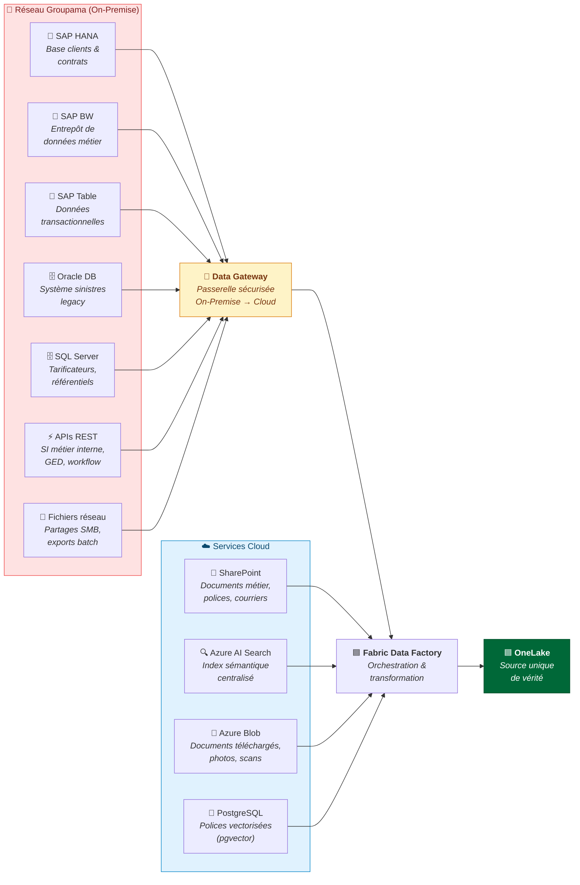

### Connecteurs SAP vérifiés dans Fabric Data Factory

| Connecteur | Mode | Passerelle | Authentification |
|-----------|------|-----------|------------------|
| **SAP HANA** | Dataflow Gen2, Pipeline, Copy Job | On-premises | Basic, Windows |
| **SAP BW Application Server** | Dataflow Gen2 | On-premises | Basic, Windows |
| **SAP BW Message Server** | Dataflow Gen2 | On-premises | Basic |
| **SAP Table Application Server** | Pipeline, Copy Job | Avec ou sans | Basic |
| **SAP Table Message Server** | Pipeline, Copy Job | Avec ou sans | Basic |
| **SAP CDC** (via ADF) | Incrémental (delta) | Azure Data Factory | ODP Framework |

### Autres connecteurs on-premise confirmés

| Source | Type | Passerelle requise |
|--------|------|--------------------|
| **Oracle Database** | Relationnelle | Oui |
| **SQL Server** | Relationnelle | Oui |
| **IBM Db2** | Relationnelle | Oui |
| **MySQL / PostgreSQL** | Relationnelle | Oui |
| **OData** | API REST | Oui |
| **ODBC / OLE DB** | Générique | Oui |
| **Fichiers / Dossiers** | Système de fichiers | Oui |
| **Teradata / Sybase** | Relationnelle | Oui |

---

## 3. FabricIQ — Plateforme de données unifiée

Microsoft Fabric centralise **toutes les données** dans OneLake et expose des capacités intelligentes via **Fabric IQ** (preview).

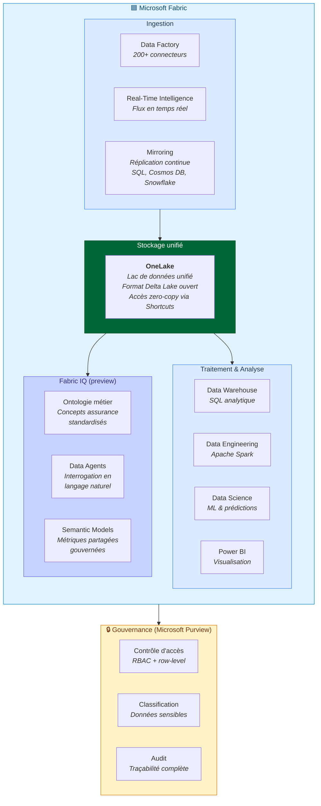

**Fabric IQ** (preview avril 2026) apporte :
- **Ontologie** : définitions métier standardisées (« sinistre », « prime », « assuré ») partagées entre les agents
- **Data Agents** : interrogation des données en langage naturel, sans écrire de SQL
- **Semantic Models** : métriques et KPIs réutilisables et gouvernés dans toute l'organisation
- **Fabric Graph** : relations entre entités métier pour le raisonnement contextuel

---

## 4. FoundryIQ — Couche agentique

Microsoft Foundry **orchestre les agents IA** qui raisonnent sur les données unifiées par Fabric.

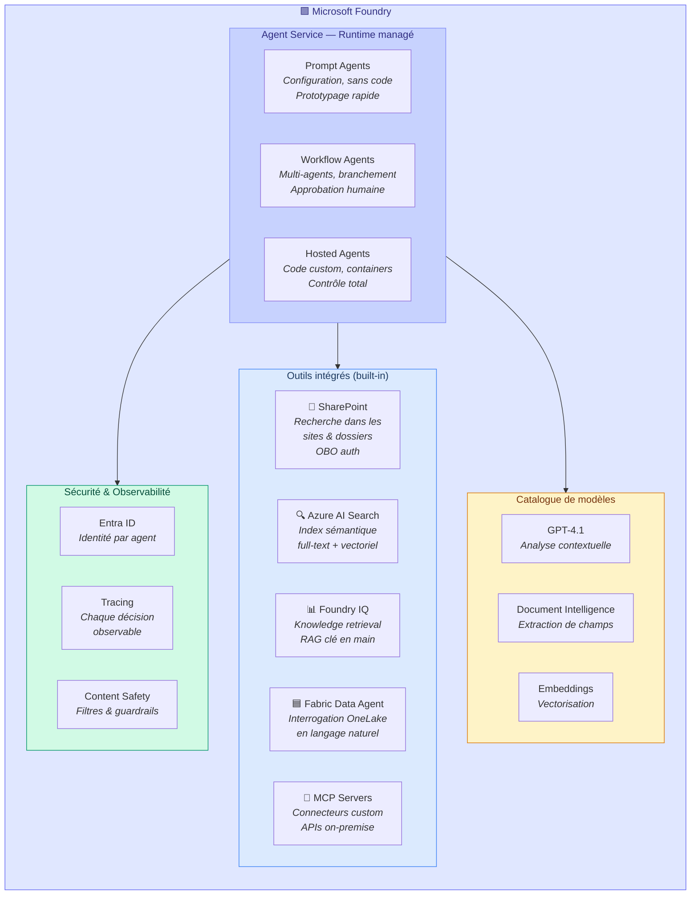

### Outils Foundry vérifiés pour GroupaIQ

| Outil | Statut | Usage pour Groupama |
|-------|--------|---------------------|
| **SharePoint** | Preview (GA prévue 2026) | Accès direct aux polices et pièces dans SharePoint Groupama, avec SSO (OBO) |
| **Azure AI Search** | GA | Index sémantique des Conditions Générales (remplace pgvector à terme) |
| **Foundry IQ** | GA | Knowledge bases clé en main pour le grounding RAG des agents |
| **Fabric Data Agent** | Preview | Interrogation OneLake : données SAP, contrats, historique sinistres |
| **MCP Servers** | Preview | Pont vers les APIs REST on-premise (SI métier, GED, tarificateurs) |
| **Code Interpreter** | GA | Calculs financiers complexes (ratios GDS/TDS/LTV) |
| **Web Search** | ✅ GA (avril 2026) | Enrichissement externe (cours immobilier, cotes véhicules), citations inline |

---

## 5. APIs métiers On-Premise — Stratégie de connexion

Les systèmes métier Groupama sont accessibles via **deux chemins complémentaires** selon le type d'accès requis.

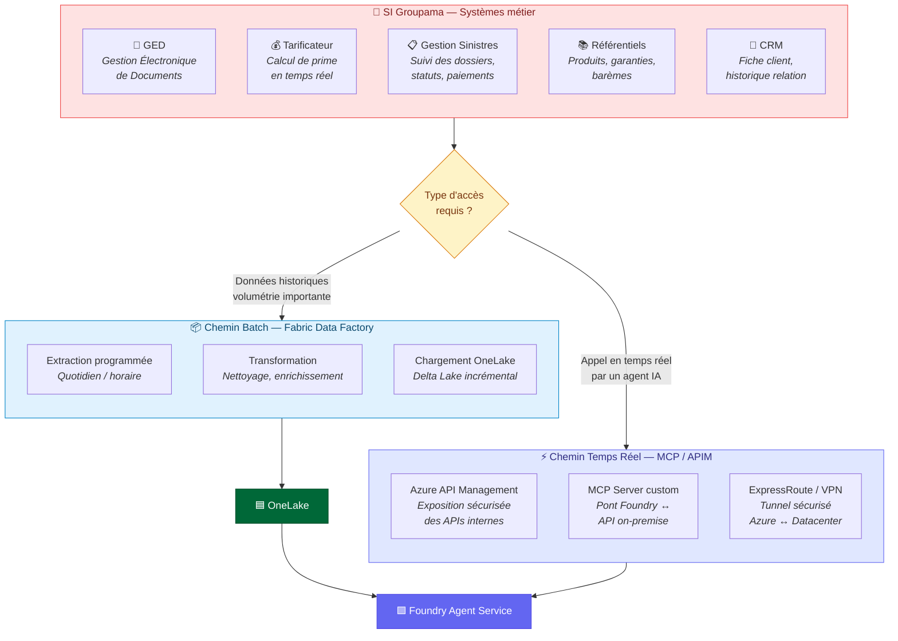

### Exemples concrets d'intégration

| Système Groupama | Chemin | Méthode | Usage |
|-----------------|--------|---------|-------|
| **SAP (contrats)** | Batch | Data Factory → SAP HANA connector → OneLake | Données contractuelles pour Client 360 |
| **GED (documents)** | Temps réel | MCP Server → API REST GED | Agent Données récupère une pièce jointe à la volée |
| **Tarificateur** | Temps réel | APIM → API SOAP/REST interne | Agent Risque appelle le tarificateur pour valider une prime |
| **Gestion Sinistres** | Batch + Temps réel | Data Factory (historique) + MCP (statut live) | Historique dans OneLake + statut temps réel pour le gestionnaire |
| **Référentiels** | Batch | Data Factory → SQL Server → OneLake | Barèmes, produits, garanties indexés par Fabric IQ |
| **CRM** | Batch | Data Factory → Oracle/SQL → OneLake | Fiche client complète pour Client 360 |

---

## 6. Architecture cible intégrée — Flux complet

Ce diagramme montre le **flux de bout en bout** : de la donnée brute à la décision, en passant par FabricIQ et FoundryIQ.

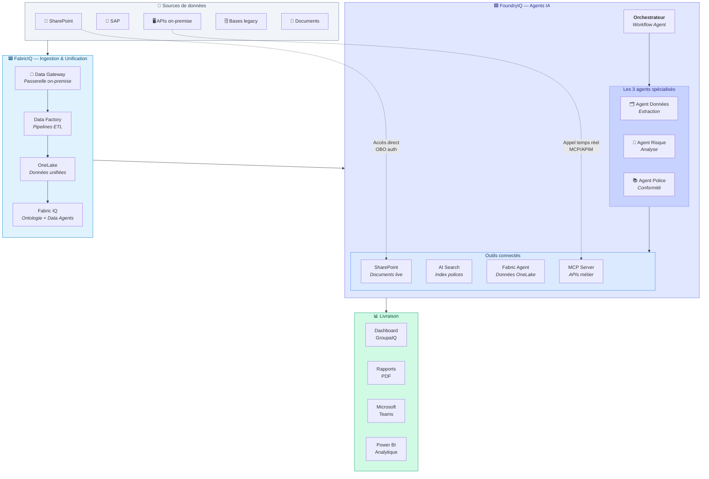

---

## 7. POC actuel vs Architecture cible

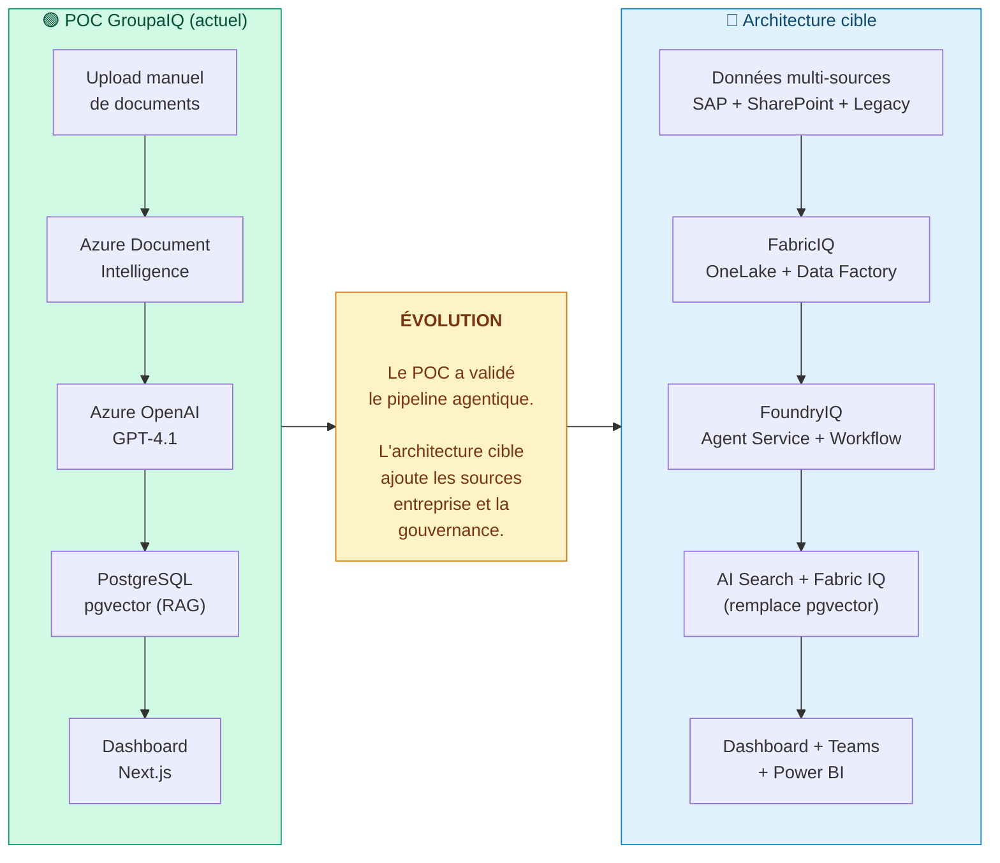

| Composant | POC actuel | Architecture cible | Changement |
|-----------|-----------|-------------------|------------|
| **Sources de données** | Upload manuel de PDF/photos | SAP, SharePoint, GED, APIs on-premise, bases legacy | Multi-canal automatisé |
| **Stockage** | Azure Blob Storage | OneLake (Fabric) + Blob | Lac unifié gouverné |
| **Recherche polices** | PostgreSQL + pgvector | Azure AI Search + Foundry IQ | Scalable + managed |
| **Orchestration agents** | FastAPI custom Python | Foundry Agent Service (Workflow Agents) | Managed + observable |
| **Modèle IA** | Azure OpenAI (direct) | Foundry Model Catalog (même modèles) | Versioning + guardrails |
| **Connecteurs métier** | Aucun | Data Factory (batch) + MCP Servers (temps réel) | Intégration SI complète |
| **Gouvernance** | API Key manuelle | Entra ID + Purview + RBAC | Enterprise-grade |
| **Livraison** | Dashboard Next.js | Dashboard + Teams + Power BI | Multi-canal |
| **Observabilité** | Logs applicatifs | Application Insights + Agent Tracing | Bout en bout |

---

## 8. Séquence cible — Traitement d'un sinistre auto

Ce diagramme montre le déroulement complet dans l'architecture cible, avec les sources multi-canaux et les outils Foundry.

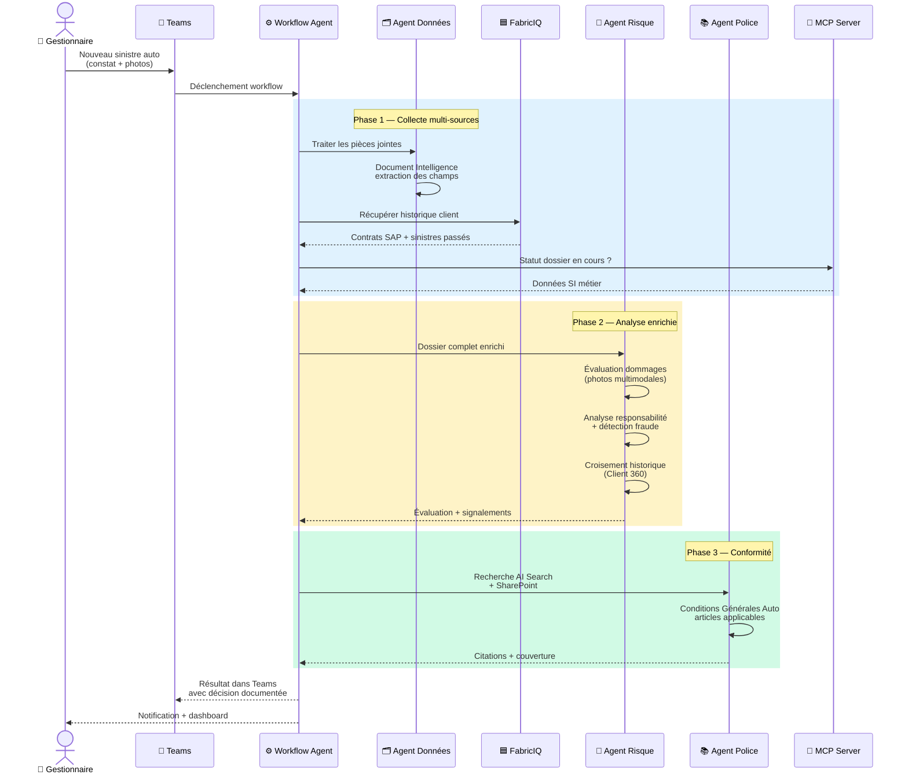

---

## 9. Matrice de faisabilité — Vérification technique

Chaque intégration est classée selon son **statut réel** dans l'écosystème Microsoft (avril 2026).

| Intégration | Statut Microsoft | Complexité | Pré-requis |
|-------------|-----------------|------------|------------|
| **SharePoint → Foundry Agent** | ✅ Preview (built-in tool) | Faible | Licence M365 Copilot, Entra ID |
| **Azure AI Search → Foundry Agent** | ✅ GA (built-in tool) | Faible | Resource AI Search déployée |
| **Foundry IQ (knowledge retrieval)** | ✅ GA | Faible | Foundry project configuré |
| **Fabric Data Factory → SAP HANA** | ✅ GA (connector) | Moyenne | Data Gateway on-premise installée |
| **Fabric Data Factory → SAP BW** | ✅ GA (connector) | Moyenne | Data Gateway + config SAP |
| **Fabric Data Factory → SAP Table** | ✅ GA (connector) | Moyenne | Avec ou sans gateway |
| **SAP CDC (delta incrémental)** | ✅ GA (via ADF) | Élevée | ODP Framework SAP, licence SAP |
| **Fabric Data Factory → Oracle/SQL** | ✅ GA (connector) | Faible | Data Gateway on-premise |
| **Fabric IQ (ontologie, data agents)** | 🟡 Preview | Moyenne | Fabric capacity, IQ workload activé |
| **Fabric Data Agent → Foundry** | 🟡 Preview | Moyenne | Fabric + Foundry liés |
| **MCP Server custom (APIs on-premise)** | 🟡 Preview | Élevée | Développement MCP custom + APIM |
| **Workflow Agents (multi-agents)** | 🟡 Preview | Moyenne | Foundry Agent Service |
| **Hosted Agents (containers custom)** | 🟡 Preview | Élevée | Container Registry + code agent |
| **OneLake Shortcuts (cross-cloud)** | ✅ GA | Faible | Comptes ADLS, S3 ou GCS |
| **Publication dans Teams** | ✅ GA | Faible | Entra Agent Registry |
| **Power BI sur OneLake** | ✅ GA | Faible | Fabric capacity |

**Légende** : ✅ GA = Disponible en production | 🟡 Preview = Utilisable mais non garanti SLA

---

## 10. Chaîne de valeur — ROI de l'architecture cible

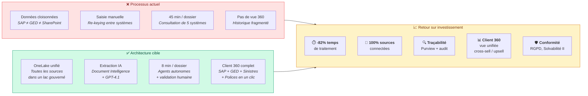

---

## 11. Microsoft Agent Framework — Pro-code pour workflows custom

Le POC GroupaIQ est actuellement implémenté en **FastAPI custom**. L'architecture cible migre les agents vers **Microsoft Agent Framework SDK**, qui offre un runtime managé, de l'observabilité native, et une publication multi-canal.

### Trois niveaux d'agents Foundry

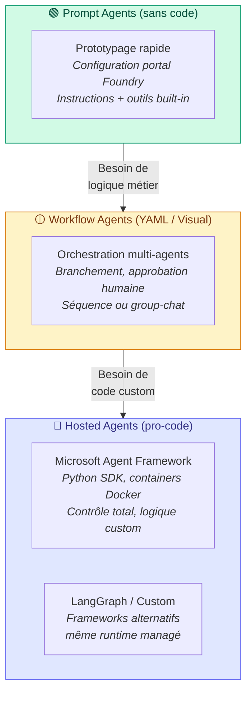

### Stratégie agents par workflow GroupaIQ

| Workflow | Type d'agent cible | Justification | Outils connectés |
|----------|-------------------|---------------|------------------|
| **Sinistres Habitation** | Hosted Agent (Agent Framework) | Logique custom : scoring dommages, corrélation historique, photos multimodales | CU, GPT-4.1, AI Search, **Web Search** (cotes immobilières), MCP→GED |
| **Sinistres Auto** | Hosted Agent (Agent Framework) | Pipeline multimodale : analyse photos + constat + cotes Argus via web search | CU, GPT-4.1 multimodal, **Web Search** (cotes véhicules), Fabric Agent→SAP |
| **Sinistres Santé** | Workflow Agent | Flux standardisé : extraction facture → vérification couverture → calcul remboursement | CU, AI Search (polices santé), Code Interpreter (calcul) |
| **Souscription** | Hosted Agent (Agent Framework) | Scoring risque complexe, APS médical multi-pages, deep dive body systems | CU, GPT-4.1, AI Search, Fabric Agent→historique sinistres |
| **Hypothécaire** | Workflow Agent + Code Interpreter | Calculs réglementaires GDS/TDS/LTV, validation documents multiples | CU, Code Interpreter, **Web Search** (taux immobiliers), AI Search |
| **Client 360** | Prompt Agent + Fabric Data Agent | Agrégation cross-persona, interrogation en langage naturel | Fabric Data Agent→OneLake, SharePoint, AI Search |

### Exemple pro-code — Agent Sinistres Habitation

```python
# Hosted Agent GroupaIQ — Microsoft Agent Framework SDK
from agent_framework import ai_function, ChatAgent
from agent_framework.azure import AzureAIAgentClient
from azure.ai.agentserver.agentframework import from_agent_framework

@ai_function
def evaluate_property_damage(claim_data: str, photos_analysis: str) -> str:
    """Évalue les dommages habitation en croisant extraction CU + analyse photos."""
    # Logique métier Groupama : barèmes, plafonds, exclusions
    ...

@ai_function
def search_market_value(address: str, surface_m2: float) -> str:
    """Recherche la valeur immobilière via données de marché."""
    # Appel API tarificateur ou données OneLake
    ...

agent = ChatAgent(
    chat_client=AzureAIAgentClient(
        project_endpoint=PROJECT_ENDPOINT,
        model_deployment_name="gpt-4.1",
        credential=DefaultAzureCredential(),
    ),
    instructions="""Vous êtes l'Agent Sinistres Habitation de Groupama.
    Analysez les déclarations de sinistre MRH en :
    1. Extrayant les champs structurés (Document Intelligence)
    2. Évaluant les dommages (photos + description)
    3. Vérifiant la couverture (Conditions Générales Habitation)
    4. Détectant les anomalies et indicateurs de fraude
    Produisez un rapport avec citations des articles applicables.""",
    tools=[evaluate_property_damage, search_market_value],
)

# Déploiement : conteneur Docker → ACR → Foundry Agent Service
if __name__ == "__main__":
    from_agent_framework(agent).run()  # localhost:8088 en dev
```

### Connecteurs agents — Fabric et outils built-in

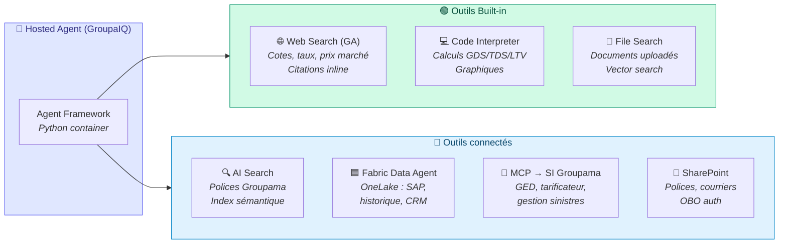

---

## 12. Stockage des résultats agents — Traçabilité et entraînement

Les agents produisent des **résultats transformés** qui doivent être stockés pour la traçabilité réglementaire, l'amélioration continue des prompts, et l'entraînement des modèles.

### Architecture de stockage des outputs agents

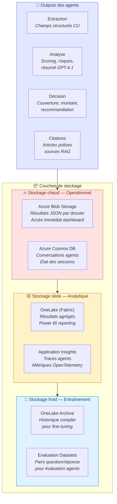

### Ce qui est stocké par type

| Type de donnée | Stockage | Rétention | Usage |
|---------------|----------|-----------|-------|
| **Extraction CU** (champs structurés) | Blob Storage (JSON) | Durée du dossier | Dashboard, audit |
| **Analyse GPT-4.1** (résumé, scoring) | Blob Storage (JSON) | Durée du dossier | Décision, rapport PDF |
| **Décision agent** (couverture, montant) | Blob Storage + Cosmos DB | Réglementaire (5+ ans) | Traçabilité, conformité |
| **Citations RAG** (articles, pages) | Blob Storage (JSON) | Durée du dossier | Justification, audit |
| **Traces agents** (steps, tool calls) | Application Insights | 90 jours | Debugging, monitoring |
| **Métriques performance** (latence, coût) | Application Insights | 90 jours | Optimisation, SLA |
| **Historique conversations** | Cosmos DB | Session + archive | Continuité, contexte |
| **Datasets d'évaluation** | OneLake (Fabric) | Long terme | Évaluation qualité agents |
| **Données d'entraînement** | OneLake Archive | Long terme | Fine-tuning, prompt optim |

### Pipeline d'amélioration continue des agents

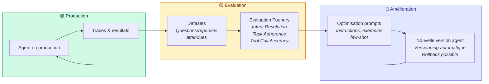

### Évaluateurs Foundry disponibles

| Évaluateur | Ce qu'il mesure |
|-----------|----------------|
| **Intent Resolution** | L'agent comprend-il correctement la demande ? |
| **Task Adherence** | L'agent suit-il ses instructions et contraintes ? |
| **Tool Call Accuracy** | L'agent appelle-t-il les bons outils avec les bons paramètres ? |
| **Relevance** | Les réponses sont-elles pertinentes par rapport au contexte ? |
| **Coherence** | Les réponses sont-elles cohérentes dans un dialogue multi-tour ? |

---

## 13. Stratégie d'adoption progressive — Liberté de choix

> **Principe clé** : le client adopte à son rythme, module par module.
> Chaque brique apporte de la valeur indépendamment des autres.
> Aucun engagement « tout ou rien ».

### Phases d'adoption recommandées

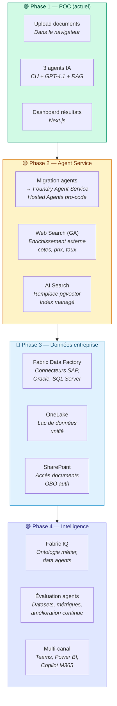

### Détail par phase

| Phase | Durée estimée | Prérequis | Valeur ajoutée | Indépendance |
|-------|--------------|-----------|----------------|-------------|
| **Phase 1 — POC** ✅ | Livré | Aucun | Validation pipeline agentique, ROI sur 5 personas | — |
| **Phase 2 — Agent Service** | 4-6 semaines | Foundry project | Runtime managé, Web Search, observabilité bout en bout | ✅ Peut être fait sans Phase 3 |
| **Phase 3 — Données entreprise** | 8-12 semaines | Fabric capacity, Data Gateway | Données SAP/legacy dans les agents, fini le re-keying | ✅ Peut être fait sans Phase 2 |
| **Phase 4 — Intelligence** | Continu | Phases 2 + 3 | Ontologie Groupama, évaluation, distribution Teams/Copilot | Nécessite les phases précédentes |

### Ce que le client peut prendre séparément

| Brique | Standalone ? | Description |
|--------|-------------|-------------|
| **Web Search** | ✅ Oui | Ajout simple : un outil built-in dans l'agent existant |
| **AI Search (polices)** | ✅ Oui | Remplace pgvector — migration d'index, même API |
| **Foundry Agent Service** | ✅ Oui | Migration du runtime Python custom → managé |
| **SharePoint** | ✅ Oui | Outil built-in Foundry, accès documents existants |
| **Data Factory (SAP)** | ✅ Oui | Ingestion batch, indépendant des agents |
| **OneLake** | ✅ Oui | Stockage unifié, fonctionne sans Fabric IQ |
| **Fabric IQ** | ⚠️ Avec Fabric | Nécessite OneLake et Fabric capacity |
| **MCP Servers (SI)** | ⚠️ Développement | Nécessite développement custom par API on-premise |
| **Teams / Copilot** | ⚠️ Avec Agent Service | Publication via Entra Agent Registry |

---

## Glossaire

| Terme | Définition |
|-------|-----------|
| **FabricIQ** | Plateforme de données Microsoft Fabric, incluant Data Factory (ingestion), OneLake (stockage unifié), et Fabric IQ (ontologie + data agents) |
| **FoundryIQ** | Plateforme d'agents IA Microsoft Foundry, incluant Agent Service (orchestration), Foundry IQ (knowledge retrieval) et le catalogue de modèles |
| **OneLake** | Lac de données unifié dans Fabric — toutes les données organisationnelles dans un seul endroit, format Delta Lake ouvert |
| **Data Gateway** | Passerelle logicielle installée dans le réseau Groupama pour connecter les systèmes on-premise au cloud de façon sécurisée |
| **Fabric IQ** | Workload Fabric (preview) : ontologie métier, data agents, semantic models, graphe de données |
| **Foundry IQ** | Système de knowledge retrieval de Foundry — RAG clé en main pour grounding des agents |
| **MCP Server** | Model Context Protocol — standard ouvert permettant aux agents Foundry d'appeler des APIs externes (on-premise, SaaS) |
| **APIM** | Azure API Management — passerelle d'APIs qui expose les services internes vers le cloud avec sécurité et monitoring |
| **OBO (On-Behalf-Of)** | Mécanisme d'authentification où l'agent agit avec l'identité de l'utilisateur final (pas un compte technique) |
| **SAP CDC** | SAP Change Data Capture — extraction incrémentale des modifications (deltas) depuis SAP via le framework ODP |
| **Agent Service** | Runtime managé de Foundry qui héberge, scale et sécurise les agents IA sans infrastructure à gérer |
| **RAG** | Retrieval-Augmented Generation — enrichir les réponses IA avec des documents réels (polices Groupama, historique sinistres) |
| **Workflow Agent** | Agent Foundry qui orchestre plusieurs agents en séquence avec branchements, approbations, et logique métier |
| **GDS / TDS / LTV** | Ratios financiers réglementaires pour l'éligibilité hypothécaire (Gross/Total Debt Service, Loan-to-Value) |
| **Purview** | Service de gouvernance Microsoft intégré à Fabric : classification, contrôle d'accès, audit, conformité RGPD |
| **Microsoft Agent Framework** | SDK Python/.NET pour construire des Hosted Agents avec logique custom, outils @ai_function, et déploiement container sur Foundry Agent Service |
| **Web Search (GA)** | Outil built-in Foundry qui utilise Grounding with Bing Search pour enrichir les réponses agents avec des données web en temps réel et des citations inline |
| **Hosted Agent** | Agent basé sur du code custom (Python, .NET), packagé en container Docker et déployé sur Foundry Agent Service avec auto-scaling |
| **A2A (Agent-to-Agent)** | Protocole de communication entre agents Foundry via endpoints A2A-compatibles (preview) |
| **Prompt Optimization** | Processus itératif d'amélioration des instructions agents via évaluation automatisée (datasets + métriques Foundry) |
| **Evaluation Datasets** | Paires question/réponse attendue utilisées pour mesurer objectivement la qualité des agents sur les métriques Intent Resolution, Task Adherence, Tool Call Accuracy |
