# GroupaIQ — Architecture Agentique Cible (V2)

> Ce document présente l'**architecture cible** que le système GroupaIQ pourrait adopter :
> comment le POC actuel s'étendrait vers une plateforme d'entreprise intégrant
> **Microsoft Foundry (FoundryIQ)**, **Microsoft Agent Framework** (pro-code),
> des sources de données hétérogènes (SharePoint, SAP, systèmes on-premise),
> et optionnellement **Microsoft Fabric (FabricIQ)** pour l'unification des données.
>
> **Principe fondamental : les données restent là où elles sont.**
> L'architecture est conçue pour accéder aux données **in situ**, sans copie ni déplacement obligatoire.
> Fabric et OneLake sont des **accélérateurs optionnels**, pas des prérequis.
>
> Les intégrations décrites s'appuient sur des **connecteurs vérifiés dans la documentation Microsoft** (avril 2026).
> Les références à des systèmes spécifiques (SAP, Oracle, GED) sont données à titre d'**exemples représentatifs**
> et seraient à adapter selon le SI réel du client.
>
> Pour l'architecture POC actuelle, voir [ARCHITECTURE-AGENTIC.md](ARCHITECTURE-AGENTIC.md).

---

## 1. Vue d'ensemble — Architecture cible

L'architecture cible reposerait sur **trois couches** qui s'empilent naturellement :
les **sources de données** alimenteraient la **couche agentique (FoundryIQ)** pour produire des décisions.
La **plateforme de données (FabricIQ)** est un **accélérateur optionnel** qui ajouterait
unification, gouvernance et ontologie métier — mais **n'est pas un prérequis**.

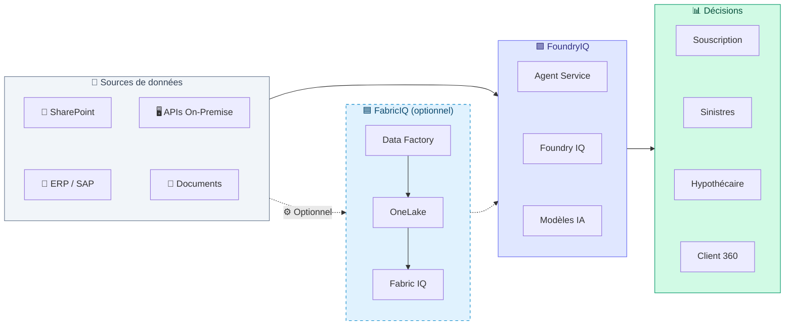

| Couche | Rôle | Produit Microsoft | Obligatoire ? |
|--------|------|-------------------|---------------|
| **Sources** | Les données brutes **restent là où elles sont** | SharePoint, ERP, APIs on-premise, bases relationnelles, documents | — |
| **FabricIQ** | Unifierait, nettoierait et gouvernerait les données | Microsoft Fabric (Data Factory + OneLake + IQ) | ⚠️ **Optionnel** |
| **FoundryIQ** | Agents IA qui raisonneraient sur les données | Microsoft Foundry (Agent Service + IQ + Modèles) | ✅ **Requis** |
| **Décisions** | Résultats métier traçables pour chaque persona | Dashboards GroupaIQ + rapports PDF | ✅ **Requis** |

> 💡 **Les données ne bougent pas.** Foundry IQ et les agents Foundry accèdent directement
> aux données via **Azure AI Search**, **Azure Blob Storage**, **SharePoint**, **MCP Servers**
> et **APIs REST** — sans qu'il soit nécessaire de copier quoi que ce soit dans OneLake.
> Fabric intervient uniquement si le client souhaite une **couche d'unification et d'ontologie métier** supplémentaire.

---

## 2. Sources de données — Connecteurs vérifiés

Ce diagramme détaille **comment chaque type de source de données** pourrait rejoindre la plateforme.
Les connecteurs listés sont **documentés et supportés par Microsoft** ; les systèmes spécifiques
(SAP, Oracle, etc.) sont donnés à titre d'exemple et dépendraient du SI réel.

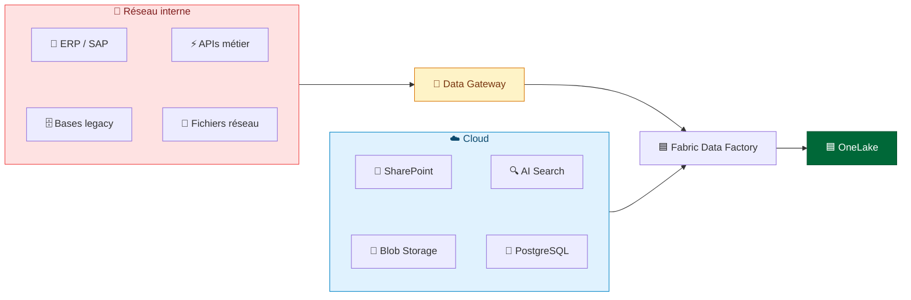

### Connecteurs SAP vérifiés dans Fabric Data Factory

> Les connecteurs ci-dessous sont documentés par Microsoft. Leur utilisation dépendrait
> de la présence effective de SAP dans le SI du client.

| Connecteur | Mode | Passerelle | Authentification |
|-----------|------|-----------|------------------|
| **SAP HANA** | Dataflow Gen2, Pipeline, Copy Job | On-premises | Basic, Windows |
| **SAP BW Application Server** | Dataflow Gen2 | On-premises | Basic, Windows |
| **SAP BW Message Server** | Dataflow Gen2 | On-premises | Basic |
| **SAP Table Application Server** | Pipeline, Copy Job | Avec ou sans | Basic |
| **SAP Table Message Server** | Pipeline, Copy Job | Avec ou sans | Basic |
| **SAP CDC** (via ADF) | Incrémental (delta) | Azure Data Factory | ODP Framework |

### Autres connecteurs on-premise confirmés

> Cette liste couvre les connecteurs les plus courants dans le secteur de l'assurance.
> Les sources effectivement présentes dépendraient du SI en place.

| Source | Type | Passerelle requise |
|--------|------|--------------------|
| **Oracle Database** | Relationnelle | Oui |
| **SQL Server** | Relationnelle | Oui |
| **IBM Db2** | Relationnelle | Oui |
| **MySQL / PostgreSQL** | Relationnelle | Oui |
| **OData** | API REST | Oui |
| **ODBC / OLE DB** | Générique | Oui |
| **Fichiers / Dossiers** | Système de fichiers | Oui |
| **Teradata / Sybase** | Relationnelle | Oui |

---

## 3. FabricIQ — Plateforme de données unifiée (optionnel)

Microsoft Fabric **pourrait** centraliser les données dans OneLake et exposer des capacités intelligentes via **Fabric IQ** (preview).
Cependant, **Fabric n'est pas un prérequis** pour faire fonctionner la couche agentique.

> 🔑 **Données in situ** : même avec Fabric, les données peuvent rester à leur emplacement d'origine
> grâce aux **OneLake Shortcuts** — des références virtuelles (zero-copy) vers Azure Data Lake Storage,
> Amazon S3, Google Cloud Storage ou d'autres workspaces Fabric.
> **Aucune copie de données n'est nécessaire.** Les moteurs Fabric (Spark, SQL, Power BI) interrogent
> les données à travers les shortcuts comme si elles étaient locales.
> *(Source : [OneLake Shortcuts — Microsoft Learn](https://learn.microsoft.com/fabric/onelake/onelake-shortcuts))*

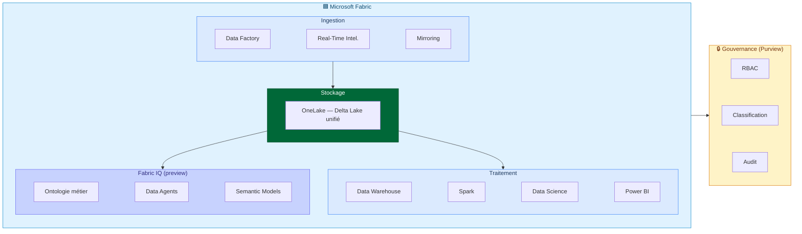

**Fabric IQ** (preview avril 2026) apporterait :
- **Ontologie** : définitions métier standardisées (« sinistre », « prime », « assuré ») partagées entre les agents
- **Data Agents** : interrogation des données en langage naturel, sans écrire de SQL
- **Semantic Models** : métriques et KPIs réutilisables et gouvernés dans toute l'organisation
- **Fabric Graph** : relations entre entités métier pour le raisonnement contextuel

---

## 4. FoundryIQ — Couche agentique

Microsoft Foundry **orchestrerait les agents IA** qui raisonnent sur les données unifiées par Fabric.

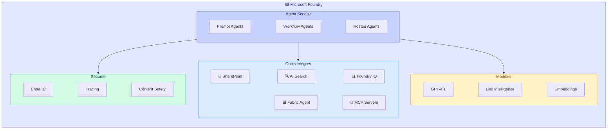

### Outils Foundry vérifiés pour un contexte assurance

| Outil | Statut | Usage potentiel |
|-------|--------|------------------|
| **SharePoint** | Preview (GA prévue 2026) | Accès aux polices et pièces dans SharePoint, avec SSO (OBO) |
| **Azure AI Search** | GA | Index sémantique des Conditions Générales (remplacerait pgvector à terme) |
| **Foundry IQ** | GA | Knowledge bases clé en main pour le grounding RAG des agents |
| **Fabric Data Agent** | Preview | Interrogation OneLake : données ERP, contrats, historique sinistres |
| **MCP Servers** | Preview | Pont vers les APIs REST on-premise (SI métier, GED, tarificateurs) |
| **Code Interpreter** | GA | Calculs financiers complexes (ratios GDS/TDS/LTV) |
| **Web Search** | ✅ GA (avril 2026) | Enrichissement externe (cours immobilier, cotes véhicules), citations inline |

---

## 5. APIs métiers On-Premise — Stratégie de connexion

Les systèmes métier internes seraient accessibles via **deux chemins complémentaires** selon le type d'accès requis.

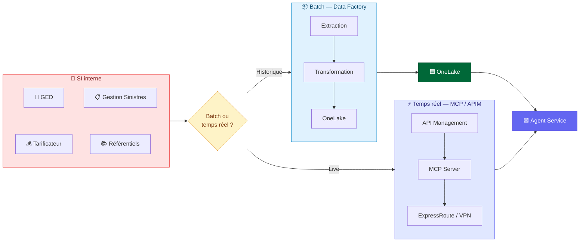

### Exemples d'intégration (selon le SI en place)

| Système (exemple) | Chemin | Méthode | Usage potentiel |
|-------------------|--------|---------|------------------|
| **ERP / SAP** | Batch | Data Factory → connecteur SAP → OneLake | Données contractuelles pour Client 360 |
| **GED** | Temps réel | MCP Server → API REST GED | Agent Données récupère une pièce jointe à la volée |
| **Tarificateur** | Temps réel | APIM → API SOAP/REST interne | Agent Risque appellerait le tarificateur pour valider une prime |
| **Gestion Sinistres** | Batch + Live | Data Factory (historique) + MCP (statut) | Historique dans OneLake + statut temps réel |
| **Référentiels** | Batch | Data Factory → base relationnelle → OneLake | Barèmes, produits, garanties indexés par Fabric IQ |
| **CRM** | Batch | Data Factory → base relationnelle → OneLake | Fiche client complète pour Client 360 |

---

## 6. Architecture cible intégrée — Flux complet

Ce diagramme montre le **flux de bout en bout** envisagé : de la donnée brute à la décision, en passant par FabricIQ et FoundryIQ.

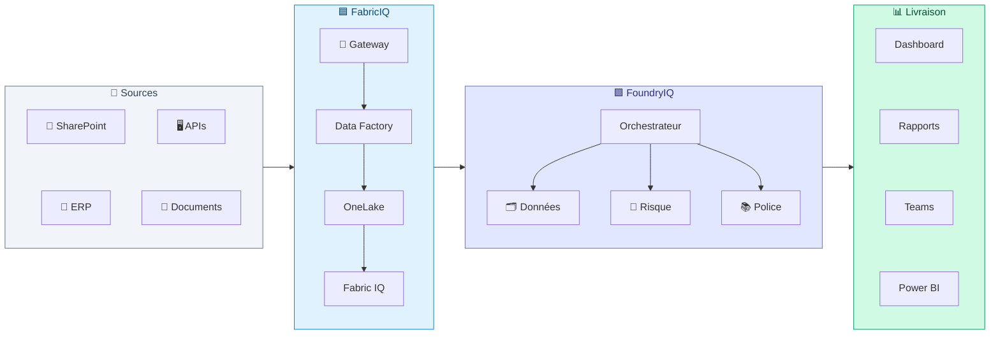

---

## 7. POC actuel vs Architecture cible

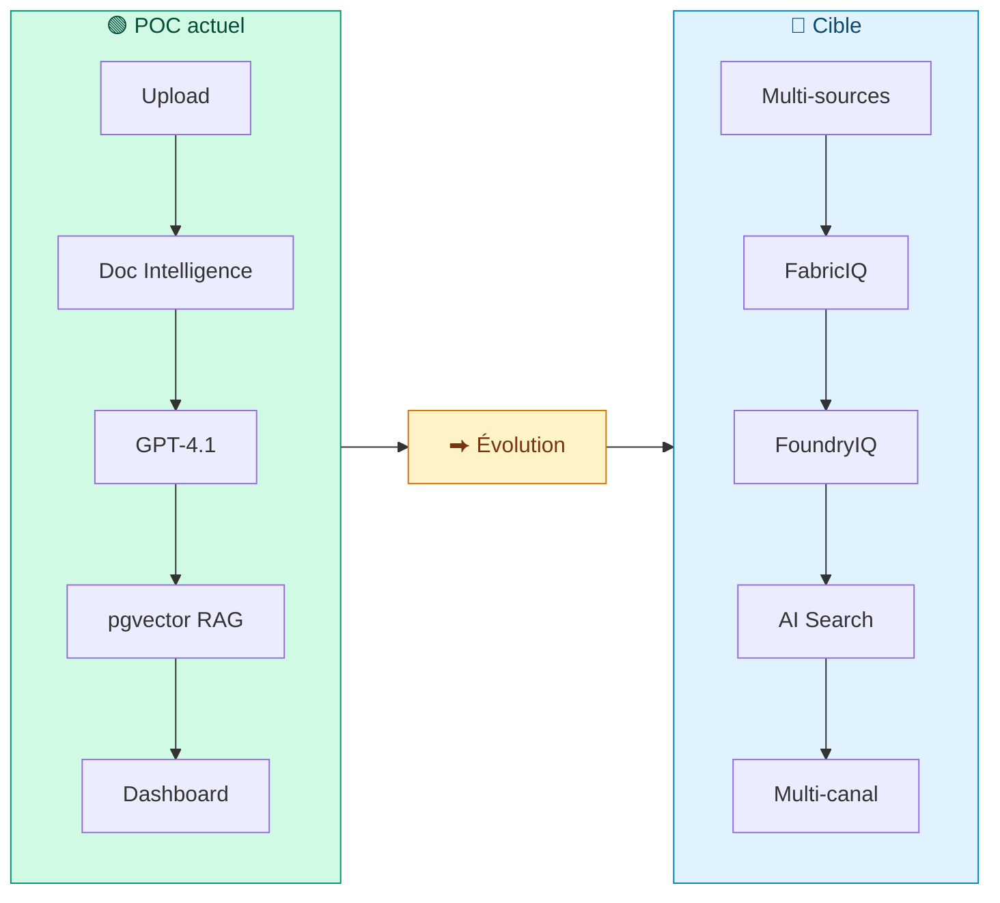

| Composant | POC actuel | Architecture cible | Changement |
|-----------|-----------|-------------------|------------|
| **Sources de données** | Upload manuel de PDF/photos | ERP, SharePoint, GED, APIs on-premise, bases legacy | Multi-canal automatisé |
| **Stockage** | Azure Blob Storage | OneLake (Fabric) + Blob *ou* Blob + AI Search seuls | Lac unifié **ou** stockage existant |
| **Recherche polices** | PostgreSQL + pgvector | Azure AI Search + Foundry IQ | Scalable + managed |
| **Orchestration agents** | FastAPI custom Python | Foundry Agent Service (Workflow Agents) | Managed + observable |
| **Modèle IA** | Azure OpenAI (direct) | Foundry Model Catalog (même modèles) | Versioning + guardrails |
| **Connecteurs métier** | Aucun | Data Factory (batch) + MCP Servers (temps réel) | Intégration SI complète |
| **Gouvernance** | API Key manuelle | Entra ID + Purview + RBAC | Enterprise-grade |
| **Livraison** | Dashboard Next.js | Dashboard + Teams + Power BI | Multi-canal |
| **Observabilité** | Logs applicatifs | Application Insights + Agent Tracing | Bout en bout |

---

## 8. Séquence cible — Traitement d'un sinistre auto

Ce diagramme montre le déroulement complet envisagé dans l'architecture cible, avec les sources multi-canaux et les outils Foundry.

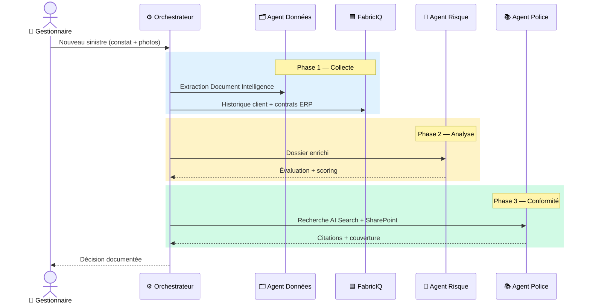

---

## 9. Matrice de faisabilité — Vérification technique

Chaque intégration est classée selon son **statut réel** dans l'écosystème Microsoft (avril 2026).
Le niveau de complexité dépendrait du SI existant et de l'infrastructure réseau.

| Intégration | Statut Microsoft | Complexité | Pré-requis |
|-------------|-----------------|------------|------------|
| **SharePoint → Foundry Agent** | ✅ Preview (built-in tool) | Faible | Licence M365 Copilot, Entra ID |
| **Azure AI Search → Foundry Agent** | ✅ GA (built-in tool) | Faible | Resource AI Search déployée |
| **Foundry IQ (knowledge retrieval)** | ✅ GA | Faible | Foundry project configuré |
| **Fabric Data Factory → SAP HANA** | ✅ GA (connector) | Moyenne | Data Gateway on-premise installée |
| **Fabric Data Factory → SAP BW** | ✅ GA (connector) | Moyenne | Data Gateway + config SAP |
| **Fabric Data Factory → SAP Table** | ✅ GA (connector) | Moyenne | Avec ou sans gateway |
| **SAP CDC (delta incrémental)** | ✅ GA (via ADF) | Élevée | ODP Framework SAP, licence SAP |
| **Fabric Data Factory → Oracle/SQL** | ✅ GA (connector) | Faible | Data Gateway on-premise |
| **Fabric IQ (ontologie, data agents)** | 🟡 Preview | Moyenne | Fabric capacity, IQ workload activé |
| **Fabric Data Agent → Foundry** | 🟡 Preview | Moyenne | Fabric + Foundry liés |
| **MCP Server custom (APIs on-premise)** | 🟡 Preview | Élevée | Développement MCP custom + APIM |
| **Workflow Agents (multi-agents)** | 🟡 Preview | Moyenne | Foundry Agent Service |
| **Hosted Agents (containers custom)** | 🟡 Preview | Élevée | Container Registry + code agent |
| **OneLake Shortcuts (cross-cloud)** | ✅ GA | Faible | Comptes ADLS, S3 ou GCS |
| **Publication dans Teams** | ✅ GA | Faible | Entra Agent Registry |
| **Power BI sur OneLake** | ✅ GA | Faible | Fabric capacity |

**Légende** : ✅ GA = Disponible en production | 🟡 Preview = Utilisable mais non garanti SLA

---

## 10. Chaîne de valeur — ROI de l'architecture cible

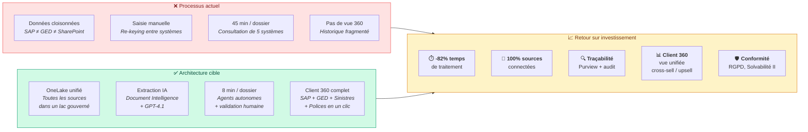

---

## 11. Microsoft Agent Framework — Pro-code pour workflows custom

Le POC GroupaIQ est actuellement implémenté en **FastAPI custom**. L'architecture cible pourrait migrer les agents vers **Microsoft Agent Framework SDK**, qui offre un runtime managé, de l'observabilité native, et une publication multi-canal.

> **Stratégie hybride** : l'architecture ne se limiterait pas à un seul framework.
> **Microsoft Agent Framework** et **LangChain / LangGraph** sont les deux piliers recommandés,
> combinables librement selon les workloads. Les agents peuvent être hébergés soit dans
> **Foundry Agent Service** (Hosted Agents), soit dans **Azure Container Apps** (ACA).
> Le choix dépendrait de la complexité du workflow, des compétences de l'équipe et des exigences d'intégration.
> Voir la **matrice de décision** en fin de section pour guider le choix par workload.

### Trois niveaux d'agents Foundry

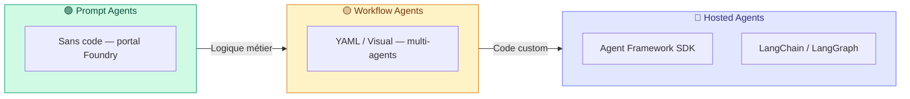

### Stratégie agents par workflow

| Workflow | Type d'agent envisagé | Justification | Outils connectés |
|----------|----------------------|---------------|------------------|
| **Sinistres Habitation** | Hosted Agent | Logique custom : scoring dommages, corrélation historique, photos multimodales | CU, GPT-4.1, AI Search, **Web Search**, MCP→GED |
| **Sinistres Auto** | Hosted Agent | Pipeline multimodale : analyse photos + constat + cotes via web search | CU, GPT-4.1, **Web Search**, Fabric Agent→ERP |
| **Sinistres Santé** | Workflow Agent | Flux standardisé : extraction facture → couverture → calcul | CU, AI Search, Code Interpreter |
| **Souscription** | Hosted Agent | Scoring complexe, APS médical multi-pages, deep dive | CU, GPT-4.1, AI Search, Fabric Agent |
| **Hypothécaire** | Workflow Agent + Code Interpreter | Calculs réglementaires GDS/TDS/LTV | CU, Code Interpreter, **Web Search**, AI Search |
| **Client 360** | Prompt Agent + Fabric Data Agent | Agrégation cross-persona, langage naturel | Fabric Agent→OneLake, SharePoint, AI Search |

### Exemple pro-code — Agent Sinistres Habitation

```python
# Hosted Agent GroupaIQ — Microsoft Agent Framework SDK
from agent_framework import ai_function, ChatAgent
from agent_framework.azure import AzureAIAgentClient
from azure.ai.agentserver.agentframework import from_agent_framework

@ai_function
def evaluate_property_damage(claim_data: str, photos_analysis: str) -> str:
    """Évalue les dommages habitation en croisant extraction CU + analyse photos."""
    # Logique métier Groupama : barèmes, plafonds, exclusions
    ...

@ai_function
def search_market_value(address: str, surface_m2: float) -> str:
    """Recherche la valeur immobilière via données de marché."""
    # Appel API tarificateur ou données OneLake
    ...

agent = ChatAgent(
    chat_client=AzureAIAgentClient(
        project_endpoint=PROJECT_ENDPOINT,
        model_deployment_name="gpt-4.1",
        credential=DefaultAzureCredential(),
    ),
    instructions="""Vous êtes l'Agent Sinistres Habitation de Groupama.
    Analysez les déclarations de sinistre MRH en :
    1. Extrayant les champs structurés (Document Intelligence)
    2. Évaluant les dommages (photos + description)
    3. Vérifiant la couverture (Conditions Générales Habitation)
    4. Détectant les anomalies et indicateurs de fraude
    Produisez un rapport avec citations des articles applicables.""",
    tools=[evaluate_property_damage, search_market_value],
)

# Déploiement : conteneur Docker → ACR → Foundry Agent Service
if __name__ == "__main__":
    from_agent_framework(agent).run()  # localhost:8088 en dev
```

### Connecteurs agents — Fabric, API, MCP et outils built-in

Les agents disposeraient de **trois familles de connexions** pour accéder aux données et aux services :

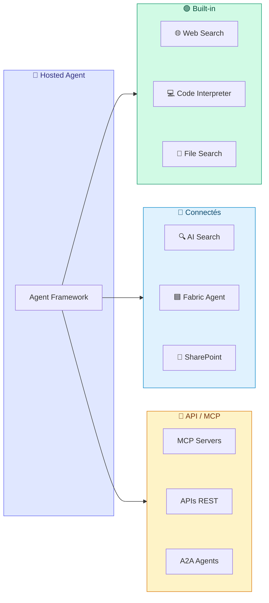

| Type de connexion | Protocole | Usage | Exemple |
|-------------------|-----------|-------|----------|
| **Built-in tools** | Natif Foundry | Outils intégrés au runtime, configuration sans code | Web Search, Code Interpreter, File Search |
| **Azure AI Search** | REST / SDK | Index sémantique managé pour le grounding RAG | Polices Groupama vectorisées |
| **SharePoint** | Graph API (OBO) | Accès documents métier avec identité utilisateur | Pièces justificatives, courriers |
| **Fabric Data Agent** | OneLake SDK | Interrogation données unifiées en langage naturel | Données ERP, historique sinistres |
| **MCP Servers** | Model Context Protocol | Pont standardisé vers APIs on-premise ou SaaS | GED, tarificateur, gestion sinistres |
| **APIs REST custom** | HTTP / APIM | Appels directs via Azure API Management | Référentiels internes, services tiers |
| **A2A (Agent-to-Agent)** | A2A Protocol | Communication inter-agents via endpoints standardisés | Orchestration multi-agents cross-domaine |
| **OpenAPI tools** | OpenAPI spec | Import automatique d'APIs depuis leur spécification | Toute API documentée en OpenAPI 3.x |

### Stratégie hybride — Liberté de choix par workload

L'architecture cible ne reposerait **pas sur un seul framework** mais sur une **approche hybride**
permettant de combiner les outils les plus adaptés à chaque workload. Cette liberté de choix
éviterait le verrouillage technologique et permettrait à chaque équipe de capitaliser sur ses compétences.

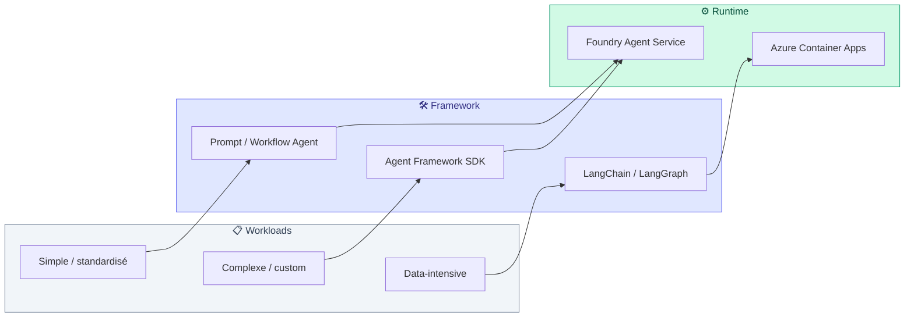

#### Matrice de décision — Quel framework pour quel workload ?

| Critère | Prompt / Workflow Agent | Agent Framework SDK | LangChain / LangGraph |
|---------|------------------------|--------------------|-----------------------|
| **Complexité** | Flux linéaires, règles simples | Logique métier custom, multi-outils | Graphs complexes, boucles, état riche |
| **Compétences requises** | No-code / low-code | Python / .NET | Python avancé |
| **Gouvernance Foundry** | ✅ Natif portal | ✅ Hosted Agent managé | ⚠️ Via ACA + APIM |
| **Observabilité** | ✅ Traces Foundry natives | ✅ OpenTelemetry intégré | ✅ LangSmith / App Insights |
| **Évaluation** | ✅ Foundry Evaluation | ✅ Foundry Evaluation | ⚠️ LangSmith ou custom |
| **Multi-agent** | ✅ Workflow YAML natif | ✅ Agent-to-Agent (A2A) | ✅ LangGraph natif |
| **Écosystème outils** | Built-in Foundry | @ai_function custom | 700+ intégrations LangChain |
| **Distribution M365** | ✅ Agents 365, Teams | ✅ Via Agent Registry | ⚠️ Via API custom |
| **Portabilité** | ⚠️ Foundry only | ⚠️ Azure-centric | ✅ Multi-cloud |

#### Scénarios hybrides recommandés pour l'assurance

| Scénario | Combinaison recommandée | Justification |
|----------|------------------------|---------------|
| **Sinistres Auto** (photos + constat + cotes) | Agent Framework SDK (orchestration) + LangGraph (graph de décision fraude) | L'orchestration multimodale se fait en Agent Framework ; la détection de fraude nécessite un graph complexe avec boucles de vérification |
| **Sinistres Habitation** (expertise + historique) | Agent Framework SDK uniquement | Workflow custom suffisant, bénéfice maximal de l'écosystème Foundry (tracing, évaluation) |
| **Souscription** (APS médical) | Agent Framework SDK + Code Interpreter | Scoring complexe avec calculs réglementaires, deep dive médical |
| **Client 360** (agrégation) | Prompt Agent (Fabric Data Agent) + Agent Framework (enrichissement) | Requêtes naturelles sur OneLake via Prompt Agent, enrichissement par un Hosted Agent |
| **Recherche polices RAG** | LangChain (retrieval) + Agent Framework (agent) | LangChain excelle pour les pipelines RAG complexes (re-ranking, hybrid search) ; le résultat alimente un agent Foundry |
| **Chatbot Teams** | Prompt Agent Foundry | Cas standard, no-code, distribution native Teams/M365 |

#### Comment choisir — Arbre de décision

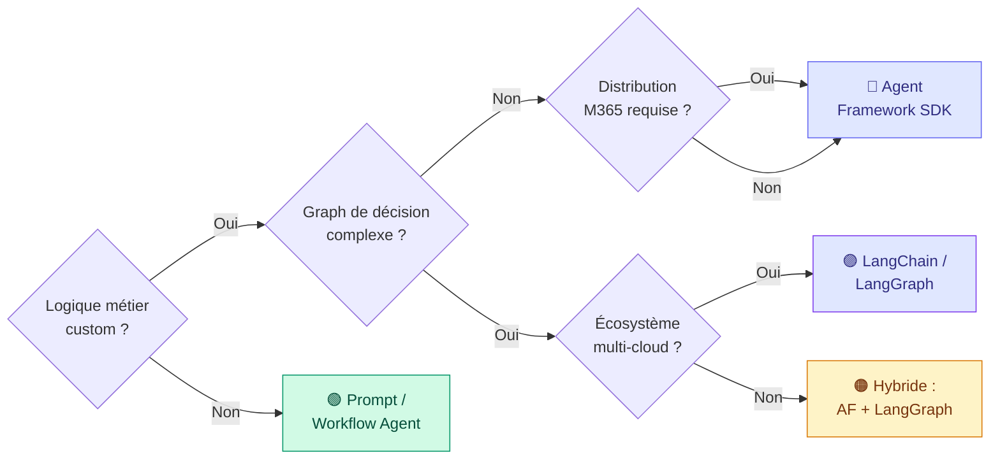

> **Clé** : la plupart des workloads d'assurance se satisferaient de **Microsoft Agent Framework SDK**
> pour bénéficier de la gouvernance Foundry native. **LangChain / LangGraph** serait privilégié
> pour les graphs de décision complexes (fraude, multi-vérification) ou lorsque la portabilité multi-cloud est requise.
> Les deux cohabitent dans la même architecture via **ACA** ou **Foundry Agent Service**.

---

## 12. Gouvernance des agents — Sécurité, identité et contrôle

Le déploiement d'agents IA en entreprise nécessiterait un **cadre de gouvernance robuste**.
L'écosystème Microsoft propose un **control plane unifié** qui couvrirait l'identité, la sécurité,
la distribution et l'observabilité des agents.

### Architecture de gouvernance

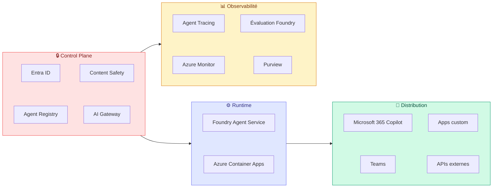

### Entra ID — Identité par agent

Chaque agent disposerait de sa propre **identité managée** dans Microsoft Entra ID :

| Capacité | Description |
|----------|-------------|
| **Managed Identity** | Chaque agent possède une identité système ou utilisateur — pas de secrets partagés |
| **OBO (On-Behalf-Of)** | L'agent agit avec les droits de l'utilisateur final, pas un compte technique |
| **RBAC granulaire** | Permissions par agent : quel agent accède à quelles données, quels outils |
| **Conditional Access** | Politiques d'accès conditionnel applicables aux agents (géo, device, risk level) |
| **Audit logs** | Chaque action d'agent tracée dans Entra ID audit logs |

### Entra Agent Registry — Publication et découverte

L'**Entra Agent Registry** centraliserait l'enregistrement et la distribution des agents :

| Fonction | Description |
|----------|-------------|
| **Enregistrement** | Chaque agent publié dans un registre centralisé avec métadonnées (nom, description, capabilities) |
| **Découverte** | Les utilisateurs et applications découvrent les agents disponibles via le registre |
| **Consentement** | Workflow d'approbation admin avant qu'un agent soit accessible aux utilisateurs |
| **Distribution M365** | Agents publiés dans Microsoft 365 Copilot, Teams, Outlook via le registre |
| **Agents 365** | Les agents enregistrés deviennent invocables comme « Agents 365 » dans l'écosystème Copilot |

### Azure AI Gateway (APIM) — Contrôle du trafic IA

Azure API Management, avec sa couche **AI Gateway**, offrirait un point de contrôle centralisé
pour tout le trafic entre les agents et les modèles IA :

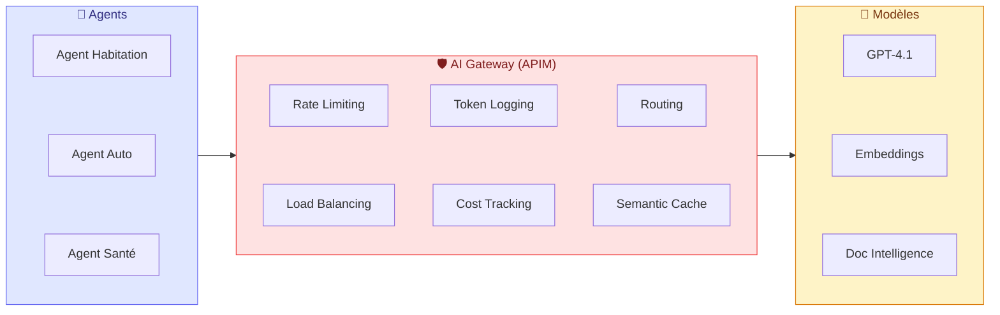

| Capacité AI Gateway | Description |
|---------------------|-------------|
| **Rate limiting** | Quotas par agent, par utilisateur ou par workflow — évite les abus et maîtrise les coûts |
| **Load balancing** | Répartition du trafic entre plusieurs déploiements de modèles (failover, latence) |
| **Token logging** | Comptage des tokens consommés par agent pour le chargeback et le reporting |
| **Cost tracking** | Suivi du coût par requête, par agent, par persona — dashboards Azure Monitor |
| **Semantic caching** | Cache des réponses similaires pour réduire les appels redondants et la latence |
| **Content filtering** | Filtrage des entrées/sorties via Azure Content Safety (texte, images) |
| **Circuit breaker** | Protection contre les cascades d'erreurs — fallback automatique |
| **Routing intelligent** | Acheminement vers le modèle optimal selon la complexité (nano → mini → full) |

### Azure Content Safety — Guardrails IA

| Protection | Périmètre |
|------------|----------|
| **Prompt injection** | Détection et blocage des tentatives de contournement des instructions agent |
| **Groundedness** | Vérification que les réponses sont ancrées dans les données fournies (pas d'hallucination) |
| **Protected material** | Détection de contenu protégé par le droit d'auteur |
| **PII detection** | Identification et masquage des données personnelles (RGPD) |
| **Custom categories** | Catégories personnalisées pour le domaine assurance (ex. : termes médicaux sensibles) |

### Matrice de gouvernance par couche

| Couche | Service | Rôle dans la gouvernance |
|--------|---------|-------------------------|
| **Identité** | Entra ID | Identité managée par agent, OBO, RBAC, audit |
| **Registre** | Entra Agent Registry | Publication, découverte, consentement, distribution M365 |
| **Gateway** | APIM + AI Gateway | Rate limiting, load balancing, cost tracking, caching |
| **Sécurité contenu** | Content Safety | Prompt injection, PII, groundedness, filtrage |
| **Runtime** | Foundry Agent Service | Hébergement managé, auto-scaling, tracing OpenTelemetry |
| **Runtime (alt.)** | Azure Container Apps | Hébergement custom, KEDA scaling, VNet isolation |
| **Données** | Purview + Fabric | Classification, lineage, conformité RGPD |
| **Observabilité** | App Insights + Monitor | Traces, métriques, alertes, dashboards |
| **Évaluation** | Foundry Evaluation | Qualité agents, datasets, amélioration continue |

---

## 13. Stockage des résultats agents — Traçabilité et entraînement

Les agents produiraient des **résultats transformés** à stocker pour la traçabilité réglementaire, l'amélioration continue des prompts, et l'entraînement des modèles.

### Architecture de stockage des outputs agents

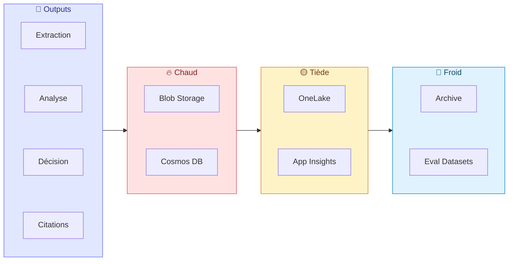

### Ce qui est stocké par type

| Type de donnée | Stockage | Rétention | Usage |
|---------------|----------|-----------|-------|
| **Extraction CU** (champs structurés) | Blob Storage (JSON) | Durée du dossier | Dashboard, audit |
| **Analyse GPT-4.1** (résumé, scoring) | Blob Storage (JSON) | Durée du dossier | Décision, rapport PDF |
| **Décision agent** (couverture, montant) | Blob Storage + Cosmos DB | Réglementaire (5+ ans) | Traçabilité, conformité |
| **Citations RAG** (articles, pages) | Blob Storage (JSON) | Durée du dossier | Justification, audit |
| **Traces agents** (steps, tool calls) | Application Insights | 90 jours | Debugging, monitoring |
| **Métriques performance** (latence, coût) | Application Insights | 90 jours | Optimisation, SLA |
| **Historique conversations** | Cosmos DB | Session + archive | Continuité, contexte |
| **Datasets d'évaluation** | OneLake (Fabric) | Long terme | Évaluation qualité agents |
| **Données d'entraînement** | OneLake Archive | Long terme | Fine-tuning, prompt optim |

### Pipeline d'amélioration continue des agents

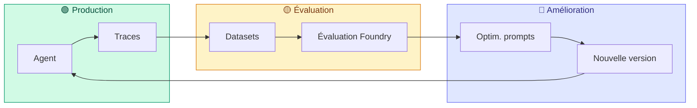

### Évaluateurs Foundry disponibles

| Évaluateur | Ce qu'il mesure |
|-----------|----------------|
| **Intent Resolution** | L'agent comprend-il correctement la demande ? |
| **Task Adherence** | L'agent suit-il ses instructions et contraintes ? |
| **Tool Call Accuracy** | L'agent appelle-t-il les bons outils avec les bons paramètres ? |
| **Relevance** | Les réponses sont-elles pertinentes par rapport au contexte ? |
| **Coherence** | Les réponses sont-elles cohérentes dans un dialogue multi-tour ? |

---

## 14. Amélioration continue par le retour humain (Human-in-the-Loop)

Les agents de conseil ne seraient pas figés : ils s'amélioreraient **en permanence** grâce aux
interventions des gestionnaires. Chaque correction, classification modifiée ou décision ajustée
par un humain enrichirait la base de connaissance et affinerait les instructions des agents.

### Boucle de rétroaction humaine

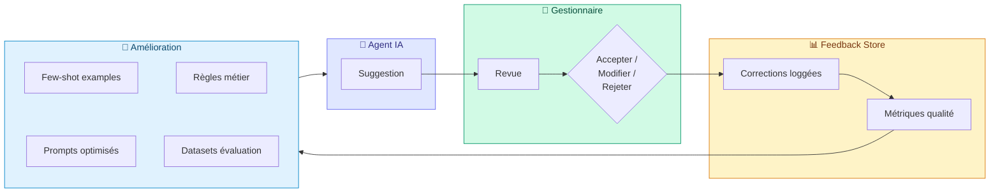

### Types d'interventions humaines et leur impact

| Intervention humaine | Exemple assurance | Impact sur l'agent |
|---------------------|-------------------|-------------------|
| **Correction de classification** | Le gestionnaire reclasse un sinistre de « dégâts des eaux » en « tempête » | L'agent apprend à mieux distinguer les catégories via few-shot examples mis à jour |
| **Modification du scoring** | Ajustement d'un score de risque de 7/10 à 4/10 avec justification | Les seuils de scoring sont recalibrés dans les instructions de l'agent |
| **Ajout d'exclusion** | Le gestionnaire identifie une clause d'exclusion manquée par l'agent | La clause est ajoutée aux règles RAG de recherche de polices |
| **Rejet d'hallucination** | L'agent cite un article de police inexistant, le gestionnaire signale l'erreur | Le feedback alimente un dataset d'évaluation de « groundedness » |
| **Ajustement de montant** | Modification du montant de remboursement proposé (de 12 500 € à 8 200 €) | Les barèmes et plafonds dans les prompts sont affinés |
| **Validation de fraude** | Confirmation ou infirmation d'un indicateur de fraude détecté | Le modèle de détection de fraude est renforcé (précision / rappel) |
| **Enrichissement contextuel** | Ajout d'informations manquantes (antécédents, photos supplémentaires) | L'agent apprend les champs critiques à demander en priorité |

### Pipeline d'amélioration par le feedback humain

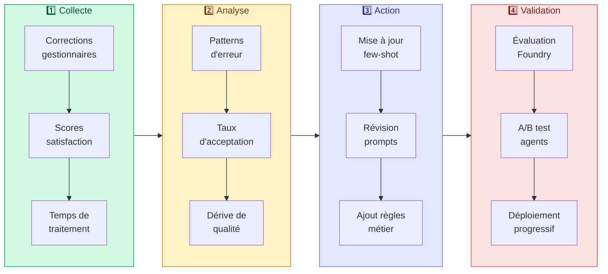

### Métriques de suivi Human-in-the-Loop

| Métrique | Description | Cible |
|----------|-------------|-------|
| **Taux d'acceptation** | % de suggestions agent acceptées sans modification | > 80 % à terme |
| **Taux de correction** | % de suggestions modifiées avant validation | < 15 % (en baisse) |
| **Taux de rejet** | % de suggestions rejetées par le gestionnaire | < 5 % |
| **Temps moyen de revue** | Durée entre suggestion et validation/rejet | En baisse continue |
| **Score de confiance calibré** | Corrélation entre le score de confiance agent et le taux d'acceptation réel | > 0.85 |
| **Dérive de qualité** | Évolution du taux d'acceptation dans le temps (détection de régression) | Stable ou en hausse |

### Exemple concret — Sinistres Habitation

1. **L'agent analyse** un dégât des eaux et propose : couverture confirmée, montant estimé 15 000 €, score 8/10
2. **Le gestionnaire revoit** : reclasse en « dommages post-événement climatique », ajuste à 11 000 € (plafond contractuel), score 6/10
3. **Le feedback est capturé** : la correction est loggée avec la justification (plafond art. 12.3, exclusion vétusté)
4. **Le système apprend** :
   - Le cas est ajouté comme **few-shot example** pour la catégorisation post-événement climatique
   - Le prompt de l'agent est enrichi avec la **référence au plafond art. 12.3**
   - Un nouveau cas de test est ajouté au **dataset d'évaluation Foundry**
5. **L'évaluation confirme** : sur les 50 prochains cas similaires, le taux d'acceptation passe de 62 % à 84 %

> **Vision** : à mesure que les gestionnaires corrigent et valident les suggestions agents,
> ceux-ci deviendraient progressivement plus précis, plus fiables et plus alignés avec
> les pratiques métier réelles. L'humain resterait toujours décisionnaire final,
> mais passerait de « corriger systématiquement » à « superviser et valider ».

---

## 15. Stratégie d'adoption progressive — Liberté de choix

> **Principe clé** : le client adopte à son rythme, module par module.
> Chaque brique apporte de la valeur indépendamment des autres.
> Aucun engagement « tout ou rien ».

### Phases d'adoption suggérées

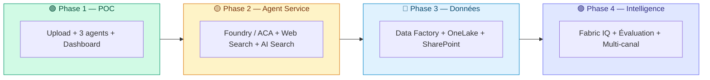

### Détail par phase

| Phase | Durée estimée | Prérequis | Valeur ajoutée | Indépendance |
|-------|--------------|-----------|----------------|-------------|
| **Phase 1 — POC** ✅ | Livré | Aucun | Validation pipeline agentique, ROI sur 5 personas | — |
| **Phase 2 — Agent Service** | 4-6 semaines | Foundry project | Runtime managé, Web Search, observabilité bout en bout | ✅ Peut être fait sans Phase 3 |
| **Phase 3 — Données entreprise** | 8-12 semaines | Fabric capacity, Data Gateway | Données ERP/legacy dans les agents, fini le re-keying | ✅ Peut être fait sans Phase 2 |
| **Phase 4 — Intelligence** | Continu | Phases 2 + 3 | Ontologie métier, évaluation, distribution Teams/Copilot | Nécessite les phases précédentes |

### Ce que le client peut prendre séparément

| Brique | Standalone ? | Description |
|--------|-------------|-------------|
| **Web Search** | ✅ Oui | Ajout simple : un outil built-in dans l'agent existant |
| **AI Search (polices)** | ✅ Oui | Remplace pgvector — migration d'index, même API |
| **Foundry Agent Service** | ✅ Oui | Migration du runtime Python custom → managé |
| **SharePoint** | ✅ Oui | Outil built-in Foundry, accès documents existants |
| **Data Factory (ERP/SQL)** | ✅ Oui | Ingestion batch, indépendant des agents |
| **OneLake** | ✅ Oui | Stockage unifié, fonctionne sans Fabric IQ |
| **Fabric IQ** | ⚠️ Avec Fabric | Nécessite OneLake et Fabric capacity |
| **MCP Servers (SI)** | ⚠️ Développement | Nécessite développement custom par API on-premise |
| **Teams / Copilot** | ⚠️ Avec Agent Service | Publication via Entra Agent Registry |

---

## Glossaire

| Terme | Définition |
|-------|-----------|
| **FabricIQ** | Plateforme de données Microsoft Fabric, incluant Data Factory (ingestion), OneLake (stockage unifié), et Fabric IQ (ontologie + data agents) |
| **FoundryIQ** | Plateforme d'agents IA Microsoft Foundry, incluant Agent Service (orchestration), Foundry IQ (knowledge retrieval) et le catalogue de modèles |
| **OneLake** | Lac de données unifié dans Fabric — toutes les données organisationnelles dans un seul endroit, format Delta Lake ouvert |
| **Data Gateway** | Passerelle logicielle installée dans le réseau du client pour connecter les systèmes on-premise au cloud de façon sécurisée |
| **Fabric IQ** | Workload Fabric (preview) : ontologie métier, data agents, semantic models, graphe de données |
| **Foundry IQ** | Système de knowledge retrieval de Foundry — RAG clé en main pour grounding des agents |
| **MCP Server** | Model Context Protocol — standard ouvert permettant aux agents Foundry d'appeler des APIs externes (on-premise, SaaS) |
| **APIM** | Azure API Management — passerelle d'APIs qui expose les services internes vers le cloud avec sécurité et monitoring |
| **OBO (On-Behalf-Of)** | Mécanisme d'authentification où l'agent agit avec l'identité de l'utilisateur final (pas un compte technique) |
| **SAP CDC** | SAP Change Data Capture — extraction incrémentale des modifications (deltas) depuis SAP via le framework ODP |
| **Agent Service** | Runtime managé de Foundry qui héberge, scale et sécurise les agents IA sans infrastructure à gérer |
| **RAG** | Retrieval-Augmented Generation — enrichir les réponses IA avec des documents réels (polices Groupama, historique sinistres) |
| **Workflow Agent** | Agent Foundry qui orchestre plusieurs agents en séquence avec branchements, approbations, et logique métier |
| **GDS / TDS / LTV** | Ratios financiers réglementaires pour l'éligibilité hypothécaire (Gross/Total Debt Service, Loan-to-Value) |
| **Purview** | Service de gouvernance Microsoft intégré à Fabric : classification, contrôle d'accès, audit, conformité RGPD |
| **Microsoft Agent Framework** | SDK Python/.NET pour construire des Hosted Agents avec logique custom, outils @ai_function, et déploiement container sur Foundry Agent Service |
| **Web Search (GA)** | Outil built-in Foundry qui utilise Grounding with Bing Search pour enrichir les réponses agents avec des données web en temps réel et des citations inline |
| **Hosted Agent** | Agent basé sur du code custom (Python, .NET), packagé en container Docker et déployé sur Foundry Agent Service ou Azure Container Apps avec auto-scaling |
| **A2A (Agent-to-Agent)** | Protocole de communication entre agents Foundry via endpoints A2A-compatibles (preview) |
| **Prompt Optimization** | Processus itératif d'amélioration des instructions agents via évaluation automatisée (datasets + métriques Foundry) |
| **Evaluation Datasets** | Paires question/réponse attendue utilisées pour mesurer objectivement la qualité des agents sur les métriques Intent Resolution, Task Adherence, Tool Call Accuracy |
| **Entra Agent Registry** | Registre centralisé dans Microsoft Entra ID pour publier, découvrir et distribuer les agents vers M365 Copilot, Teams et applications custom |
| **Agents 365** | Agents enregistrés dans l'Entra Agent Registry et invocables depuis Microsoft 365 Copilot, Teams, Outlook |
| **AI Gateway (APIM)** | Couche d'Azure API Management dédiée au trafic IA : rate limiting, load balancing, token logging, cost tracking, semantic caching |
| **Content Safety** | Service Azure de filtrage et protection IA : détection prompt injection, PII, groundedness, contenu protégé |
| **Control Plane** | Ensemble des services de gouvernance (Entra ID, Agent Registry, AI Gateway, Content Safety) qui encadrent le cycle de vie des agents |
| **Stratégie hybride** | Approche architecturale combinant plusieurs frameworks (Agent Framework SDK, LangChain/LangGraph, Prompt Agents) selon les besoins de chaque workload |
| **Human-in-the-Loop (HITL)** | Boucle de rétroaction où les corrections et validations humaines alimentent l'amélioration continue des agents (few-shot, prompts, règles) |
| **Few-shot examples** | Exemples concrets (entrée → sortie attendue) ajoutés aux prompts agents pour guider le comportement sur des cas spécifiques, enrichis au fil des corrections humaines |
| **Taux d'acceptation** | Métrique clé HITL : pourcentage de suggestions agent acceptées sans modification par les gestionnaires — indicateur de maturité de l'agent |
| **OneLake Shortcuts** | Références virtuelles (zero-copy) dans OneLake pointant vers des données externes (ADLS, S3, GCS, SharePoint) sans copie ni déplacement |
| **Data Residency** | Principe selon lequel les données restent dans leur localisation géographique et leur stockage d'origine, sans transfert vers un lac centralisé |

---

## FAQ — Questions fréquentes sur les données et l'architecture

### Localisation et souveraineté des données

**Q : Mes données doivent-elles être déplacées dans OneLake ou Fabric pour que la plateforme agentique fonctionne ?**

**Non.** La plateforme agentique (Foundry + agents) peut fonctionner **sans Microsoft Fabric**.
Les agents Foundry accèdent directement aux données via :
- **Azure AI Search** (index sémantique sur vos documents, où qu'ils soient stockés)
- **Azure Blob Storage** (documents, PDFs, photos)
- **SharePoint** (outil built-in Foundry avec authentification OBO)
- **MCP Servers** (pont vers vos APIs on-premise : GED, tarificateur, etc.)
- **APIs REST** via APIM (tout système exposé en HTTP)

Les données restent là où elles sont. Aucune migration n'est requise.

---

**Q : Foundry IQ peut-il fonctionner sans Fabric ?**

**Oui.** Foundry IQ est une **couche de connaissance autonome** (knowledge layer) indépendante de Fabric.
Ses sources de connaissances supportées incluent :
- Azure Blob Storage
- SharePoint
- OneLake (si Fabric est présent)
- Données web publiques

Foundry IQ est bâti sur **Azure AI Search** (agentic retrieval) — pas sur Fabric.
*(Source : [Foundry IQ FAQ — Microsoft Learn](https://learn.microsoft.com/azure/foundry/agents/concepts/foundry-iq-faq))*

---

**Q : Quelle est la différence entre Fabric IQ, Foundry IQ et Work IQ ?**

Ce sont **trois couches IQ indépendantes**, chacune autonome :

| IQ | Périmètre | Prérequis | Standalone ? |
|----|----------|-----------|-------------|
| **Foundry IQ** | Connaissances entreprise (documents, Blob, SharePoint, web) | Azure AI Search | ✅ Oui |
| **Fabric IQ** | Données analytiques (ontologie, semantic models, data agents) | Microsoft Fabric | ✅ Oui |
| **Work IQ** | Collaboration M365 (documents, réunions, chats) | Microsoft 365 | ✅ Oui |

On peut utiliser un, deux ou trois IQ ensemble. La plateforme agentique ne nécessite que **Foundry IQ** au minimum.
*(Source : [Foundry IQ — Relationship to Fabric IQ and Work IQ](https://learn.microsoft.com/azure/foundry/agents/concepts/what-is-foundry-iq#relationship-to-fabric-iq-and-work-iq))*

---

**Q : Si j'utilise Fabric, mes données sont-elles copiées ?**

**Pas forcément.** Fabric offre deux stratégies complémentaires :

| Stratégie | Copie ? | Mécanisme | Cas d'usage |
|----------|---------|-----------|-------------|
| **Shortcuts** (recommandé) | ❌ Non | Référence virtuelle vers ADLS, S3, GCS, SharePoint | La donnée reste chez le client, zero-copy |
| **Mirroring** | ✅ Oui (réplication) | CDC continu depuis bases opérationnelles | Bases transactionnelles SQL, Cosmos DB |
| **Pipelines (Data Factory)** | ✅ Oui (batch) | ETL classique avec transformation | Historique ERP, référentiels |

Avec les **Shortcuts**, les moteurs Fabric interrogent les données **in place** sans aucune copie.
*(Source : [Get data into Fabric — Shortcuts](https://learn.microsoft.com/fabric/fundamentals/get-data#access-external-data-with-shortcuts))*

---

### Architecture sans Fabric

**Q : Peut-on faire fonctionner la plateforme agentique complète sans Fabric ?**

**Oui.** Voici l'architecture minimale sans Fabric :

| Composant | Sans Fabric | Avec Fabric |
|-----------|-------------|-------------|
| **Stockage documents** | Azure Blob Storage | OneLake (ou Shortcuts vers Blob) |
| **RAG / Polices** | Azure AI Search + Foundry IQ | Azure AI Search + Foundry IQ + Fabric IQ |
| **Données ERP/legacy** | MCP Servers + APIs REST via APIM | Data Factory → OneLake + Fabric Data Agent |
| **Agent runtime** | Foundry Agent Service / ACA | Foundry Agent Service / ACA |
| **Modèles IA** | Azure OpenAI / Foundry Models | Azure OpenAI / Foundry Models |
| **Gouvernance** | Entra ID + APIM + Purview | Entra ID + APIM + Purview + Fabric Gov |
| **Ontologie métier** | ❌ Non disponible | ✅ Fabric IQ (semantic models, data agents) |
| **Langage naturel sur données** | ❌ Non disponible | ✅ Fabric Data Agent |

> Fabric apporte un **plus** (ontologie, Data Agents, unification), mais n'est pas requis pour le pipeline agentique.

---

**Q : Quand Fabric devient-il vraiment utile ?**

Fabric ajouterait une valeur significative dans ces scénarios :

| Scénario | Pourquoi Fabric ? |
|----------|-------------------|
| **Client 360** (agrégation cross-domaine) | OneLake unifie les données de multiples sources ; Fabric Data Agent permet des requêtes en langage naturel |
| **Reporting Power BI avancé** | Semantic models Fabric alimentent Power BI avec gouvernance intégrée |
| **Historique massif** (millions de sinistres) | OneLake + Spark traitent les volumes que Blob + AI Search seuls ne gèrent pas efficacement |
| **Ontologie métier partagée** | Fabric IQ standardise les définitions (sinistre, prime, assuré) entre tous les agents |
| **ERP intégration profonde** | Data Factory offre 200+ connecteurs batch natifs (SAP, Oracle, etc.) |

---

### Sécurité et conformité

**Q : Les données traitées par les agents restent-elles dans Azure ?**

**Oui.** Azure AI Agent Service garantit que :
- Les données (prompts, réponses) ne sont **PAS** partagées avec d'autres clients
- Les données ne sont **PAS** utilisées pour entraîner les modèles OpenAI, Meta ou Mistral
- Le traitement se fait dans la **région Azure choisie** (ex. France Central)

**Exception** : l'outil Grounding with Bing Search transfère des données hors du boundary Azure
(soumis à des conditions d'utilisation séparées). Ce tool est désactivable par l'administrateur.
*(Source : [Data, privacy, and security for Agent Service](https://learn.microsoft.com/azure/foundry/responsible-ai/agents/data-privacy-security))*

---

**Q : Puis-je contrôler la région de déploiement de mes agents ?**

**Oui.** Tous les composants (Foundry, AI Search, Blob, OpenAI) sont déployés dans une région Azure
spécifique (ex. **France Central**). Les données ne quittent pas cette région sauf activation
explicite de services cross-région (Bing Search, geo-replication).

---

### Coût et progressivité

**Q : Quel est le coût d'entrée minimum pour la plateforme agentique ?**

| Niveau | Composants | Coût indicatif |
|--------|------------|----------------|
| **Minimum** (POC actuel) | Azure OpenAI + Blob + App Service | ~200 €/mois |
| **Production sans Fabric** | Foundry Agent Service + AI Search + Blob + APIM | ~500–1 500 €/mois |
| **Production avec Fabric** | Ci-dessus + Fabric F2/F4 capacity | +1 000–3 000 €/mois |

> Fabric représente le coût le plus élevé. Démarrer sans Fabric et l'ajouter ultérieurement
> est parfaitement viable et recommandé.

---

**Q : Puis-je commencer sans Fabric et l'ajouter plus tard ?**

**Oui, c'est l'approche recommandée.** La stratégie d'adoption (section 15) prévoit :
1. **Phase 1** : POC avec Blob + AI Search (livré)
2. **Phase 2** : Foundry Agent Service (sans Fabric)
3. **Phase 3** : Fabric (si nécessaire pour Client 360, ERP, ontologie)

Chaque phase est indépendante. Aucun engagement « tout ou rien ».
