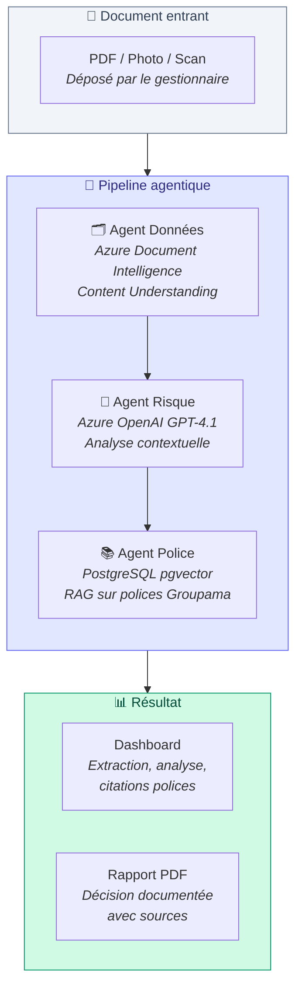
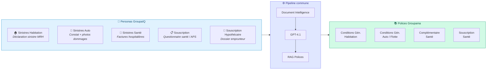
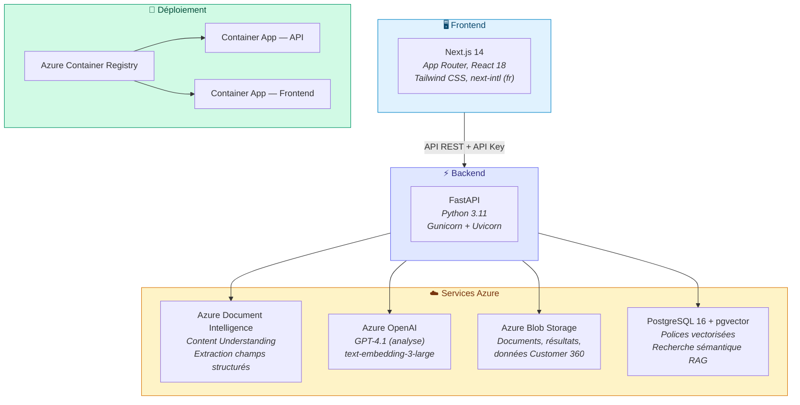
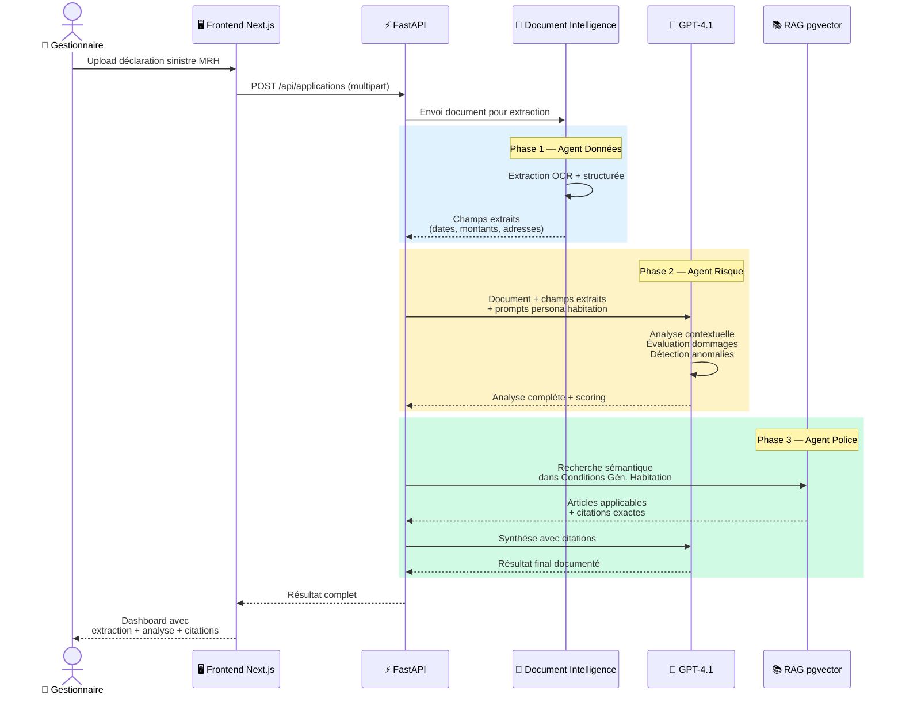
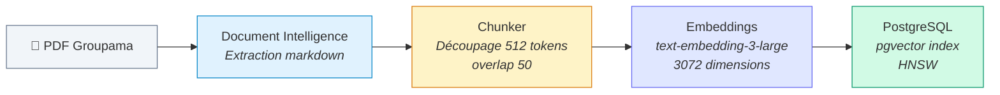
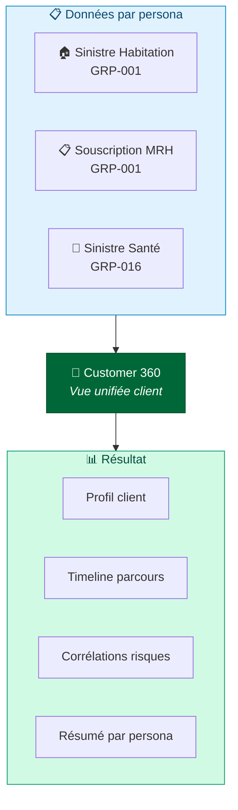

# GroupaIQ — Architecture Agentique POC

> **Audience** : Direction générale, architectes d'entreprise, décideurs techniques et non-techniques
>
> Ce document présente l'**architecture agentique du POC GroupaIQ** actuellement
> déployé en production. Trois agents IA spécialisés orchestrent l'analyse des
> documents d'assurance via une pipeline **Document Intelligence → GPT-4.1 → RAG**.
>
> Pour l'architecture cible avec Fabric IQ, Foundry IQ, Microsoft Agent Framework,
> et sources de données hétérogènes, voir [ARCHITECTURE-AGENTIC-V2-TARGET.md](ARCHITECTURE-AGENTIC-V2-TARGET.md).

---

## 1. Vue d'ensemble — Pipeline agentique

Le POC GroupaIQ repose sur **trois agents spécialisés** qui travaillent en séquence
pour transformer un document brut (PDF, photo, scan) en une décision métier documentée.

| Agent | Rôle | Technology Azure |
|-------|------|------------------|
| **🗂️ Agent Données** | Extrait les champs structurés du document (dates, montants, noms, adresses) | Azure Document Intelligence (Content Understanding) |
| **🧠 Agent Risque** | Analyse le contenu, évalue les risques, détecte les anomalies, scoring | Azure OpenAI GPT-4.1 (+ multimodal pour les photos) |
| **📚 Agent Police** | Recherche les articles applicables dans les Conditions Générales Groupama | PostgreSQL 16 + pgvector (recherche sémantique RAG) |

---

## 2. Les 5 personas métier

GroupaIQ sert **cinq workflows métier distincts**, chacun activant les trois agents
avec des prompts et des polices de référence adaptés.

| Persona | Document type | Polices RAG | Résultat clé |
|---------|--------------|-------------|--------------|
| **Sinistres Habitation** | Déclaration sinistre MRH | Conditions Générales Habitation | Estimation dommages, couverture, exclusions |
| **Sinistres Auto** | Constat amiable + photos | Conditions Auto / Flotte Auto | Évaluation dégâts, responsabilité, fraude |
| **Sinistres Santé** | Facture hospitalière, devis optique | Complémentaire Santé | Remboursement, plafonds, exclusions |
| **Souscription** | APS médical, questionnaire santé | Souscription Santé | Scoring risque, recommandation |
| **Hypothécaire** | Dossier emprunteur, évaluation bien | — | Ratios GDS/TDS/LTV, éligibilité |

---

## 3. Architecture technique déployée

| Composant | Technologie | Région Azure |
|-----------|-------------|-------------|
| **Frontend** | Next.js 14, TypeScript, Tailwind, next-intl (fr) | France Central |
| **Backend** | Python 3.11, FastAPI, Gunicorn + Uvicorn | France Central |
| **Extraction** | Azure Document Intelligence (Content Understanding) | France Central |
| **LLM** | Azure OpenAI GPT-4.1 (2025-04-14) | France Central |
| **Embeddings** | text-embedding-3-large (3072 dims) | France Central |
| **Stockage** | Azure Blob Storage | France Central |
| **RAG** | PostgreSQL 16 Flexible Server + pgvector | France Central |
| **Registre images** | Azure Container Registry | France Central |
| **Hébergement** | Azure Container Apps (2 apps) | France Central |

---

## 4. Séquence — Traitement d'un sinistre habitation

---

## 5. RAG — Recherche dans les polices Groupama

### 4 documents indexés

| Fichier PDF | Catégorie | Catégorie DB |
|-------------|-----------|-------------|
| Conditions Générales Habitation | Habitation | property_casualty |
| Complémentaire Santé | Santé | life_health |
| Conditions Générales Auto | Auto | automotive |
| Conditions Générales Flotte Auto | Flotte | automotive |

### Méthodes de recherche

| Méthode | Description |
|---------|-----------|
| **semantic_search()** | Similarité vectorielle pure (cosine) |
| **filtered_search()** | Vecteur + filtres métadonnées (catégorie, risk_level) |
| **intelligent_search()** | LLM infère la catégorie → vecteur + filtre |
| **hybrid_search()** | pgvector + trigram text search combinés |

### Pipeline d'indexation

---

## 6. Customer 360 — Vue client unifiée

Le persona **Client 360** agrège les données de tous les workflows en une vue unifiée par client.

- **30 clients Groupama** pré-importés (GRP-001 à GRP-030)
- **GRP-001** (Olivier MERTENS LAFFITE) : lié aux démos habitation + souscription
- **GRP-016** (Aurélie FONTAINE) : liée à la démo santé
- **Persistance** : Azure Blob Storage (survit aux redéploiements)

---

## 7. Sécurité et gouvernance

| Aspect | Implémentation POC |
|--------|-------------------|
| **Authentification API** | API Key (min 32 caractères) |
| **Stockage** | Azure Blob Storage (résidence France Central) |
| **Réseau** | Container Apps avec HTTPS |
| **Données sensibles** | Pas de données réelles en POC |
| **CI/CD** | GitHub Actions + OIDC (pas de secret client) |
| **Observabilité** | Logs applicatifs + health check `/` |

---

## 8. Métriques POC

| Métrique | Valeur POC |
|----------|-----------|
| **Temps extraction CU** | 15-45 secondes par document |
| **Temps analyse GPT-4.1** | 10-30 secondes |
| **Temps recherche RAG** | < 1 seconde |
| **5 personas opérationnelles** | Habitation, Auto, Santé, Souscription, Hypothécaire |
| **4 polices indexées** | ~200 chunks vectorisés |
| **30 clients démo** | Données Customer 360 persistées |

---

## Glossaire

| Terme | Définition |
|-------|-----------|
| **Content Understanding** | Service Azure Document Intelligence qui extrait des champs structurés de documents non structurés (PDF, photos, scans) |
| **GPT-4.1** | Modèle de langage Azure OpenAI utilisé pour l'analyse contextuelle, le scoring de risque et la synthèse |
| **pgvector** | Extension PostgreSQL pour le stockage et la recherche de vecteurs (embeddings) |
| **RAG** | Retrieval-Augmented Generation — enrichir les réponses IA avec des documents réels (polices Groupama) |
| **HNSW** | Hierarchical Navigable Small World — algorithme d'index vectoriel pour la recherche approximative rapide |
| **Persona** | Workflow métier avec ses propres prompts, polices de référence et interface adaptée |
| **Customer 360** | Vue unifiée d'un client agrégeant toutes les interactions à travers les personas |
| **Container Apps** | Service Azure pour héberger des containers Docker sans gérer l'infrastructure |
