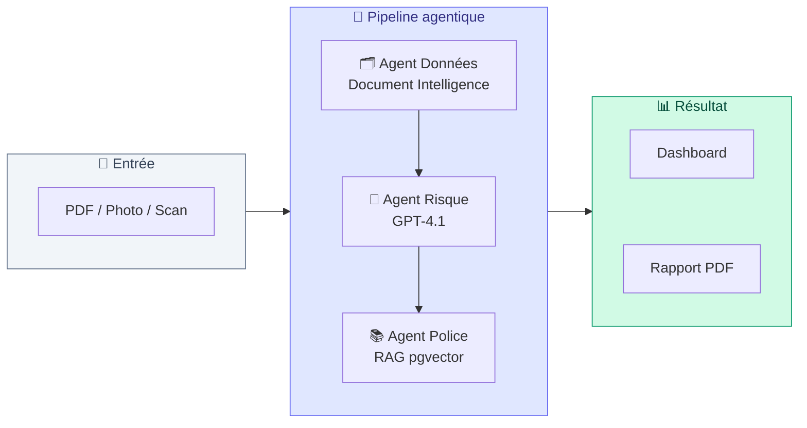
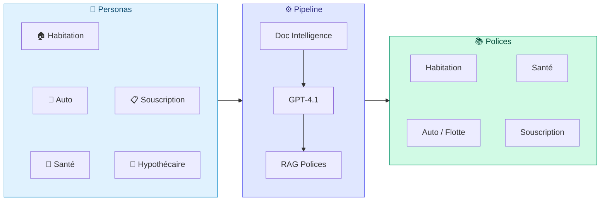
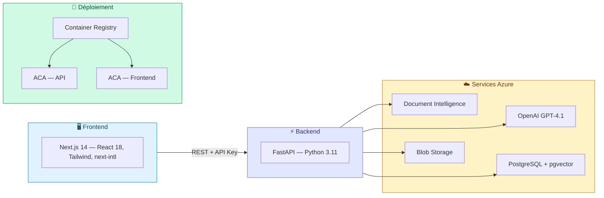
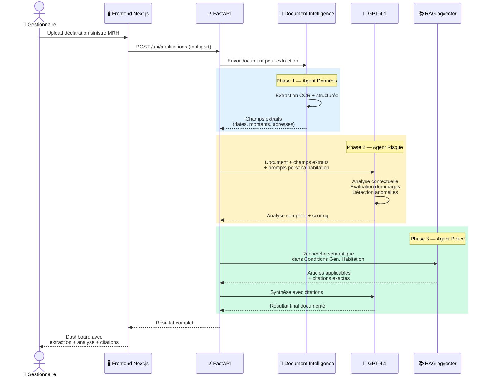
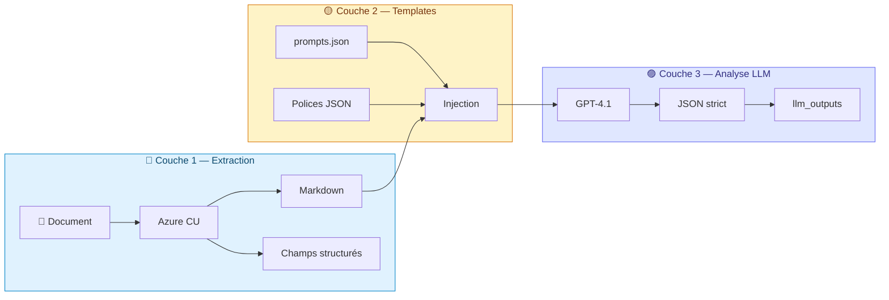
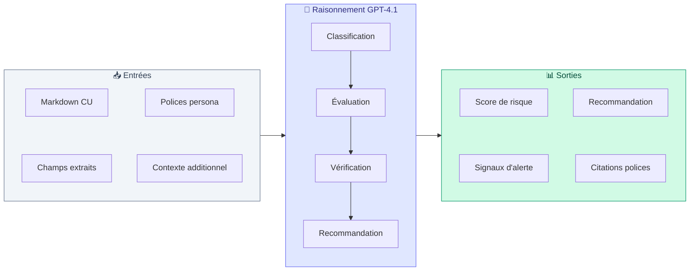
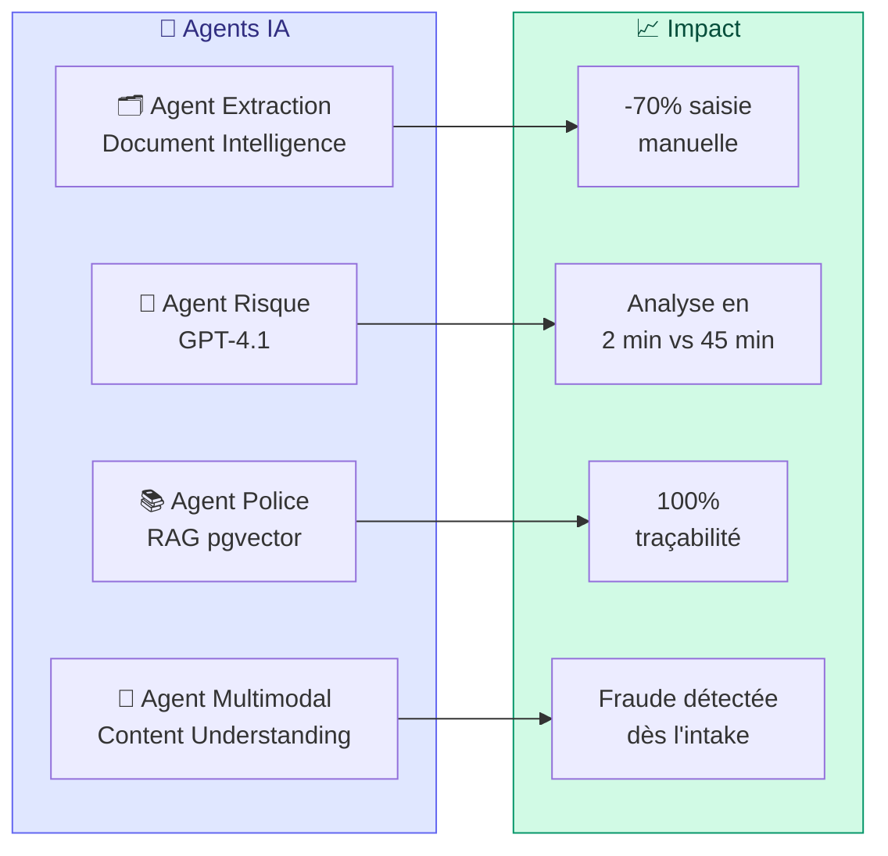
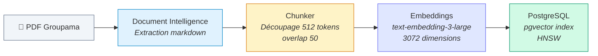
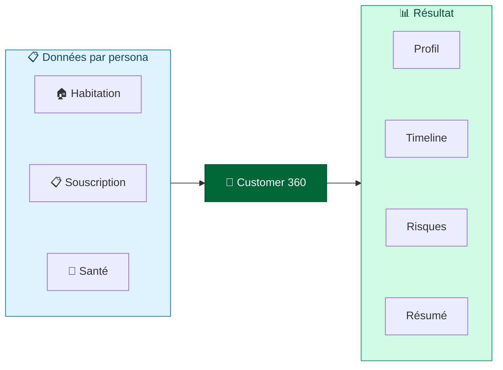

# GroupaIQ — Architecture Agentique POC

> Ce document présente l'**architecture agentique du POC GroupaIQ** actuellement
> déployé en production. Trois agents IA spécialisés orchestrent l'analyse des
> documents d'assurance via une pipeline **Document Intelligence → GPT-4.1 → RAG**.
>
> Pour l'architecture cible avec Fabric IQ, Foundry IQ, Microsoft Agent Framework,
> et sources de données hétérogènes, voir [ARCHITECTURE-AGENTIC-V2-TARGET.md](ARCHITECTURE-AGENTIC-V2-TARGET.md).

---

## 1. Vue d'ensemble — Pipeline agentique

Le POC GroupaIQ repose sur **trois agents spécialisés** qui travaillent en séquence
pour transformer un document brut (PDF, photo, scan) en une décision métier documentée.

| Agent | Rôle | Technology Azure |
|-------|------|------------------|
| **🗂️ Agent Données** | Extrait les champs structurés du document (dates, montants, noms, adresses) | Azure Document Intelligence (Content Understanding) |
| **🧠 Agent Risque** | Analyse le contenu, évalue les risques, détecte les anomalies, scoring | Azure OpenAI GPT-4.1 (+ multimodal pour les photos) |
| **📚 Agent Police** | Recherche les articles applicables dans les Conditions Générales Groupama | PostgreSQL 16 + pgvector (recherche sémantique RAG) |

---

## 2. Les 5 personas métier

GroupaIQ sert **cinq workflows métier distincts**, chacun activant les trois agents
avec des prompts et des polices de référence adaptés.

| Persona | Document type | Polices RAG | Résultat clé |
|---------|--------------|-------------|--------------|
| **Sinistres Habitation** | Déclaration sinistre MRH | Conditions Générales Habitation | Estimation dommages, couverture, exclusions |
| **Sinistres Auto** | Constat amiable + photos | Conditions Auto / Flotte Auto | Évaluation dégâts, responsabilité, fraude |
| **Sinistres Santé** | Facture hospitalière, devis optique | Complémentaire Santé | Remboursement, plafonds, exclusions |
| **Souscription** | APS médical, questionnaire santé | Souscription Santé | Scoring risque, recommandation |
| **Hypothécaire** | Dossier emprunteur, évaluation bien | — | Ratios GDS/TDS/LTV, éligibilité |

---

## 3. Architecture technique déployée

| Composant | Technologie | Région Azure |
|-----------|-------------|-------------|
| **Frontend** | Next.js 14, TypeScript, Tailwind, next-intl (fr) | France Central |
| **Backend** | Python 3.11, FastAPI, Gunicorn + Uvicorn | France Central |
| **Extraction** | Azure Document Intelligence (Content Understanding) | France Central |
| **LLM** | Azure OpenAI GPT-4.1 (2025-04-14) | France Central |
| **Embeddings** | text-embedding-3-large (3072 dims) | France Central |
| **Stockage** | Azure Blob Storage | France Central |
| **RAG** | PostgreSQL 16 Flexible Server + pgvector | France Central |
| **Registre images** | Azure Container Registry | France Central |
| **Hébergement** | Azure Container Apps (2 apps) | France Central |

---

## 4. Séquence — Traitement d'un sinistre habitation

---

## 5. Pipeline IA en 3 couches — Flux détaillé

L'analyse GroupaIQ repose sur un pipeline séquentiel à **3 couches** : extraction documentaire,
injection de templates avec contexte métier, puis analyse LLM avec sortie JSON stricte.

### Couche 1 — Extraction (Azure Content Understanding)

Chaque fichier est routé automatiquement vers l'analyseur approprié selon son type et le persona actif.

| Type de fichier | Analyseur | Données extraites |
|----------------|-----------|-------------------|
| **PDF / Documents** | `prebuilt-documentSearch` (défaut) ou analyseur custom | Markdown sémantique + champs structurés |
| **Images** (.jpg/.png) | `prebuilt-image` ou `autoClaimsImageAnalyzer` (auto) | Zones de dommages, sévérité, score de confiance |
| **Vidéos** (.mp4/.mov) | `autoClaimsVideoAnalyzer` (auto) | Keyframes, segments temporels, transcription |

| Persona | Analyseur Documents | Analyseur Images | Analyseur Vidéo |
|---------|-------------------|-----------------|-----------------|
| **Souscription** | prebuilt-documentSearch | prebuilt-image | — |
| **Sinistres Santé** | prebuilt-documentSearch | prebuilt-image | — |
| **Sinistres Auto** | autoClaimsDocAnalyzer | autoClaimsImageAnalyzer | autoClaimsVideoAnalyzer |
| **Sinistres Habitation** | prebuilt-documentSearch | prebuilt-image | — |
| **Hypothécaire** | prebuilt-documentSearch | prebuilt-image | — |

### Couche 2 — Templates et Contexte Métier

Les prompts sont organisés en **sections / subsections** dans `prompts.json`, avec injection de variables à l'exécution :

| Variable injectée | Source | Rôle |
|-------------------|--------|------|
| `{underwriting_policies}` | Fichiers `*-policies.json` par persona | Règles métier et barèmes applicables |
| Document markdown | Extraction CU (couche 1) | Contenu brut du document analysé |
| `additional_context` | Résumés par lots (documents > 100 Ko) | Contexte étendu pour gros documents |
| `{glossary}` | `prompts/glossary.json` | Terminologie métier standardisée |

### Couche 3 — Analyse LLM (GPT-4.1)

- Sections exécutées **séquentiellement** (dépendances entre sections)
- Subsections exécutées **en parallèle** (4 workers)
- Sortie JSON **stricte** avec réparation automatique si troncature
- Résultat stocké dans `llm_outputs[section][subsection]`

---

## 6. Logique de raisonnement — Agent Risque

L'Agent Risque (GPT-4.1) applique une **chaîne de raisonnement structurée** pour chaque dossier.
Le raisonnement varie selon le persona mais suit toujours le même pattern.

### Étapes de raisonnement par persona

| Étape | Sinistres Auto | Sinistres Habitation | Souscription Santé |
|-------|---------------|---------------------|-------------------|
| **1. Classification** | Type de dommage (mineur → perte totale), zones touchées | Nature du sinistre (DDE, incendie, vol), étendue | Profil médical, classe de risque |
| **2. Évaluation** | Estimation coût (pièces + MO + peinture), responsabilité % | Montant estimé, contenu vs structure | Scoring pathologies, antécédents familiaux |
| **3. Vérification** | Articles CG Auto applicables, exclusions, franchise | Articles CG Habitation, IRSI, Cat-Nat, franchise DDE | Polices souscription, exclusions médicales |
| **4. Recommandation** | Montant ± 20%, subrogation si tiers >50% | Indemnisation, mandat expert si >5 000 € | Acceptation / surprime / refus + justification |

### Classification des dommages (Sinistres Auto)

| Niveau | Dommage | Coût estimé | Action déclenchée |
|--------|---------|-------------|-------------------|
| 🟢 **Mineur** | Rayure / bosse < 15 cm | 0 – 1 000 € | Approbation rapide |
| 🟡 **Modéré** | Dommages multi-panneaux | 1 000 – 5 000 € | Documentation photo requise |
| 🟠 **Lourd** | Airbag / structure / suspension | 5 000 – 15 000 € | Revue senior + inspection |
| 🔴 **Perte totale** | Réparation > 70 % valeur véhicule | Variable | Évaluation de récupération |

### Détection de fraude — Signaux d'alerte

L'Agent Risque produit un **score de fraude** avec indicateurs classés par sévérité :

| Niveau | Signal | Exemple |
|--------|--------|---------|
| 🔴 **Élevé** | Incohérence majeure | Description "accident stationnement" mais dommages compatibles avec collision haute vitesse |
| 🟡 **Modéré** | Élément à vérifier | Sinistre déclaré 3 jours après les faits, pas de témoin |
| 🟢 **Faible** | Aucune anomalie | Dossier cohérent, preuves concordantes |

---

## 7. Chaîne de valeur — Impact métier des agents

### Les 4 agents et leur impact

### Score d'impact business

| Métrique | Avant GroupaIQ | Après GroupaIQ | Gain |
|----------|---------------|----------------|------|
| **Temps FNOL** | 30-45 min | 3-5 min | **-85 %** |
| **Saisie manuelle** | 100 % | 30 % | **-70 %** |
| **Détection fraude** | Manuelle, tardive | Automatique, dès l'intake | **+80 % détection** |
| **Conformité polices** | Vérification humaine | Citations automatiques | **100 % traçabilité** |
| **Satisfaction client (NPS)** | Délais élevés | Réponse rapide | **+25 points** |
| **Ratio de dépenses** | Élevé | Réduit | **-30 %** |

### Détail par agent

| Agent | Périmètre | Impact principal |
|-------|-----------|-----------------|
| **🗂️ Agent Extraction** | Constats, factures, rapports médicaux, CG → markdown sémantique indexé | Suppression de 70 % de la saisie manuelle |
| **🧠 Agent Risque** | Analyse multimodale (texte + image + vidéo), scoring, responsabilité, fraude | Analyse en 2 min vs 30-45 min, cohérence des décisions |
| **📚 Agent Police** | 4 PDF CG Groupama vectorisés, recherche sémantique en français | Conformité garantie, décisions traçables et auditables |
| **🎥 Agent Multimodal** | Photos → zones de dommages + sévérité, vidéos → keyframes + timeline | Évaluation visuelle automatique, croisement déclaration vs preuves |

---

## 8. RAG — Recherche dans les polices Groupama

### 4 documents indexés

| Fichier PDF | Catégorie | Catégorie DB |
|-------------|-----------|-------------|
| Conditions Générales Habitation | Habitation | property_casualty |
| Complémentaire Santé | Santé | life_health |
| Conditions Générales Auto | Auto | automotive |
| Conditions Générales Flotte Auto | Flotte | automotive |

### Méthodes de recherche

| Méthode | Description |
|---------|-----------|
| **semantic_search()** | Similarité vectorielle pure (cosine) |
| **filtered_search()** | Vecteur + filtres métadonnées (catégorie, risk_level) |
| **intelligent_search()** | LLM infère la catégorie → vecteur + filtre |
| **hybrid_search()** | pgvector + trigram text search combinés |

### Pipeline d'indexation

---

## 9. Customer 360 — Vue client unifiée

Le persona **Client 360** agrège les données de tous les workflows en une vue unifiée par client.

- **30 clients Groupama** pré-importés (GRP-001 à GRP-030)
- **GRP-001** (Olivier MERTENS LAFFITE) : lié aux démos habitation + souscription
- **GRP-016** (Aurélie FONTAINE) : liée à la démo santé
- **Persistance** : Azure Blob Storage (survit aux redéploiements)

---

## 10. Sécurité et gouvernance

| Aspect | Implémentation POC |
|--------|-------------------|
| **Authentification API** | API Key (min 32 caractères) |
| **Stockage** | Azure Blob Storage (résidence France Central) |
| **Réseau** | Container Apps avec HTTPS |
| **Données sensibles** | Pas de données réelles en POC |
| **CI/CD** | GitHub Actions + OIDC (pas de secret client) |
| **Observabilité** | Logs applicatifs + health check `/` |

---

## 11. Métriques POC

| Métrique | Valeur POC |
|----------|-----------|
| **Temps extraction CU** | 15-45 secondes par document |
| **Temps analyse GPT-4.1** | 10-30 secondes |
| **Temps recherche RAG** | < 1 seconde |
| **5 personas opérationnelles** | Habitation, Auto, Santé, Souscription, Hypothécaire |
| **4 polices indexées** | ~200 chunks vectorisés |
| **30 clients démo** | Données Customer 360 persistées |

---

## Glossaire

| Terme | Définition |
|-------|-----------|
| **Content Understanding** | Service Azure Document Intelligence qui extrait des champs structurés de documents non structurés (PDF, photos, scans) |
| **GPT-4.1** | Modèle de langage Azure OpenAI utilisé pour l'analyse contextuelle, le scoring de risque et la synthèse |
| **pgvector** | Extension PostgreSQL pour le stockage et la recherche de vecteurs (embeddings) |
| **RAG** | Retrieval-Augmented Generation — enrichir les réponses IA avec des documents réels (polices Groupama) |
| **HNSW** | Hierarchical Navigable Small World — algorithme d'index vectoriel pour la recherche approximative rapide |
| **Persona** | Workflow métier avec ses propres prompts, polices de référence et interface adaptée |
| **Customer 360** | Vue unifiée d'un client agrégeant toutes les interactions à travers les personas |
| **Container Apps** | Service Azure pour héberger des containers Docker sans gérer l'infrastructure |
